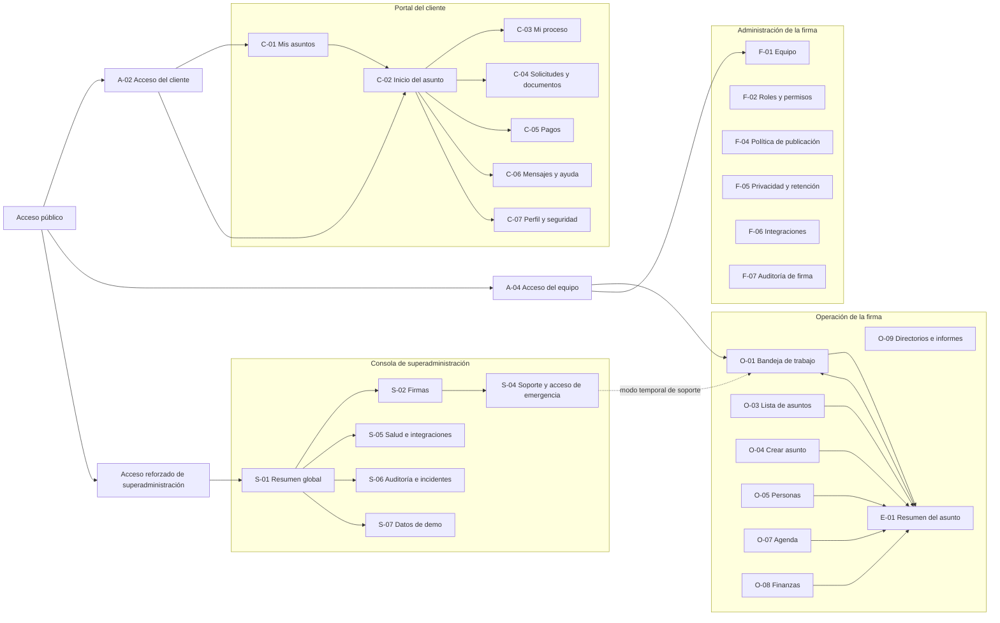
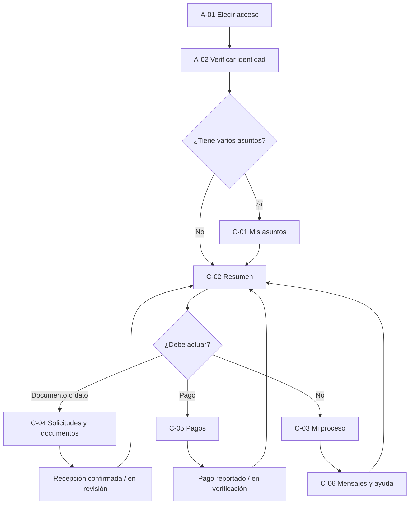
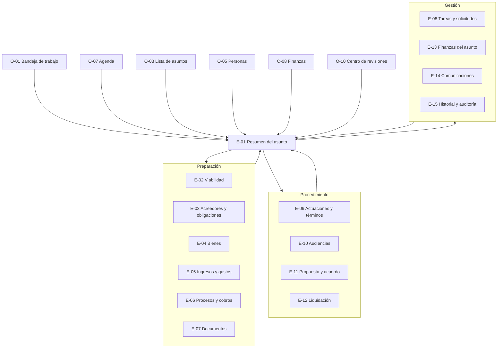
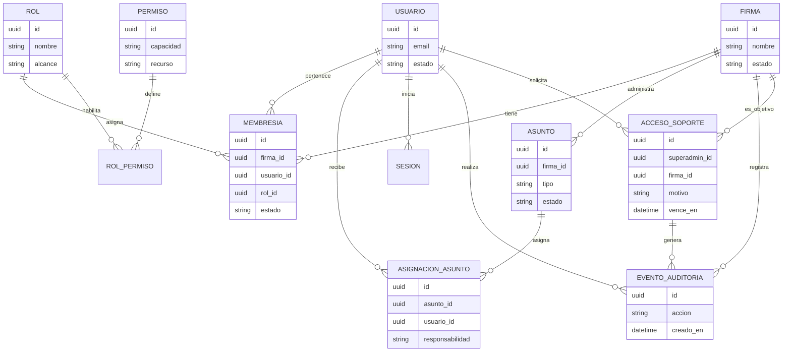
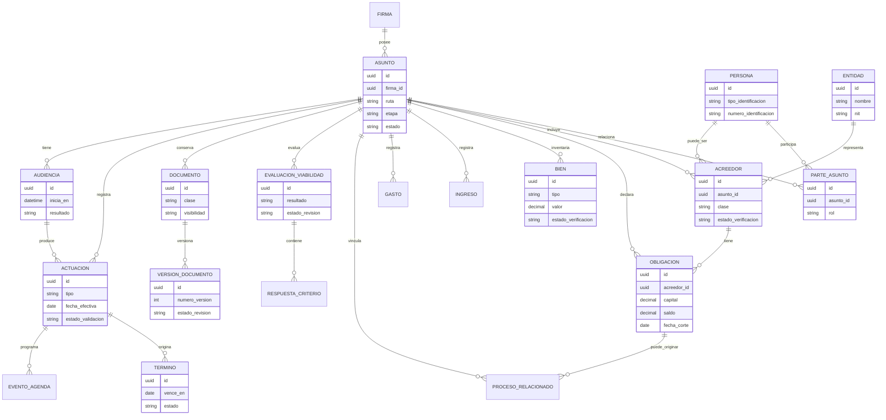
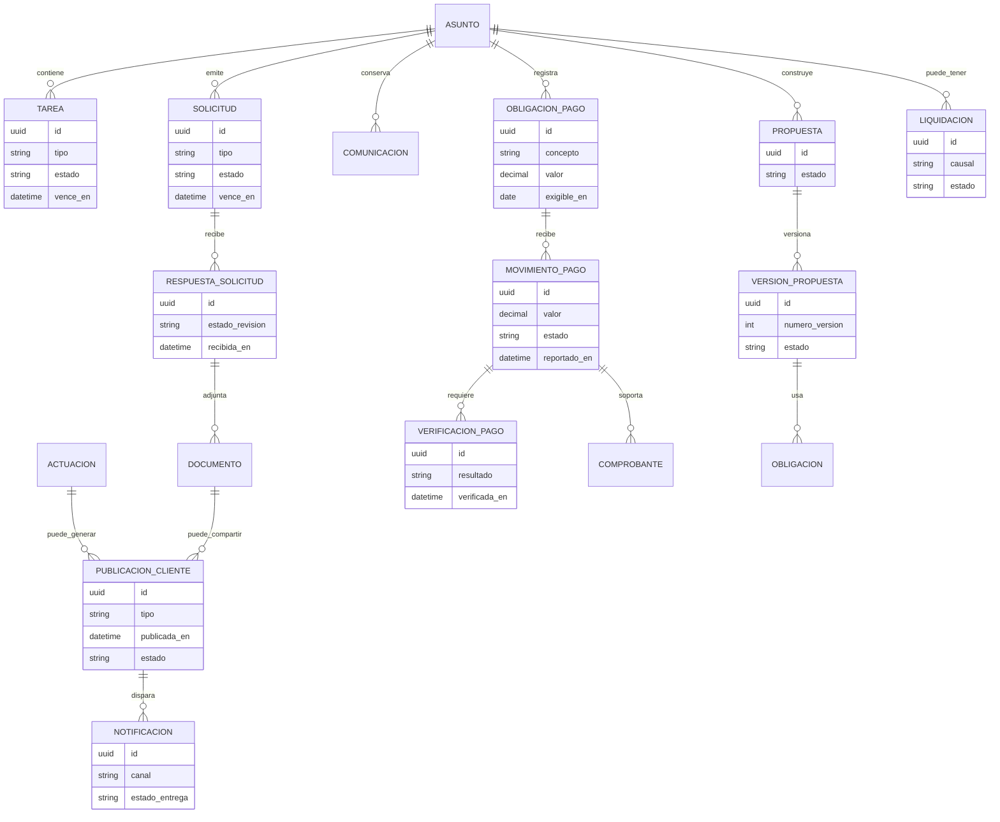
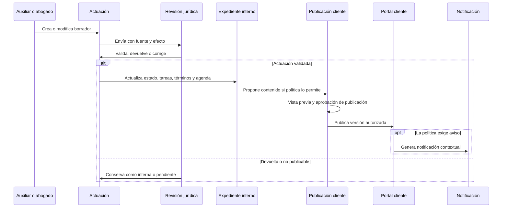

## 0. Contexto del negocio

### 0.1 ¿Qué hace la oficina?

La oficina de abogados se dedica principalmente a procesos de **insolvencia económica** (también llamados de **negociación de pasivos**) de personas naturales. El proceso legal, explicado en detalle durante la reunión, funciona así:

1. **Solicitud de negociación de pasivos:** El cliente (deudor) contrata a la oficina. La abogada redacta un escrito formal de solicitud donde se relata la situación económica del cliente: por qué contrajo deudas, a quiénes les debe (acreedores: bancos, cooperativas, Secretaría de Movilidad, etc.), cuánto les debe a cada uno, cuáles son sus ingresos actuales, cuáles son sus gastos de subsistencia (servicios públicos, internet, celular) y cuál es su propuesta de pago (por ejemplo: "pago el 100% del capital en 120 meses, condónenme los intereses ya causados pero les pago un interés futuro a partir de agosto").
2. **Documentos anexos necesarios:** Para armar la solicitud, la oficina le pide al cliente: cédula, desprendible de pago, certificado laboral, REDAM (Registro de Deudores Alimentarios Morosos), tarjeta de identidad de los hijos, registros civiles, y otros documentos según el caso. La mayoría de los casos requieren los mismos documentos; algunos tienen documentos adicionales.
3. **Radicación ante el Centro de Conciliación:** La solicitud completa (escrito + anexos) se presenta ante un Centro de Conciliación.
4. **Admisión:** El Centro de Conciliación admite la negociación (rara vez la rechaza en esta etapa; los rechazos suelen ocurrir en audiencia).
5. **Fijación de fecha de audiencia:** Una vez admitido, se programa una audiencia de negociación.
6. **Audiencia(s):** Normalmente hay pocas audiencias por proceso. En cada audiencia se genera un acta (documento que resume lo ocurrido en la diligencia). El acta la redacta el conciliador/a. La abogada asiste y luego envía un resumen a su auxiliar para registro interno.
7. **Resultado:**
   - **Acuerdo:** Los acreedores aceptan la propuesta de pago. El cliente empieza a pagar según lo acordado. El proceso conciliatorio finaliza.
   - **Fracaso (lo más frecuente):** Los acreedores no aceptan. Se genera un **acta de fracaso**. La conciliadora declara fracasada la negociación y remite el proceso a **Liquidación Patrimonial**.
8. **Liquidación Patrimonial (proceso judicial):** El proceso pasa de un Centro de Conciliación a un **Juzgado**. Aquí el cliente le dice al juez: "Intenté negociar pero no se pudo. Pido que me mande a liquidación y pagué con mis bienes." Si el cliente no tiene bienes con que pagar, el juez declara las deudas **insolutas**, la persona vuelve a estado natural (sin deudas), y ya no le cobran más. Sin embargo, queda en lista negra de los bancos.

### 0.2 Estructura actual de la oficina

- **Edwin** — Abogado titular / administrador. Es quien recibe a los clientes inicialmente y les solicita los documentos. Es quien conoce el proceso de primera mano y maneja los contactos.
- **Hannahi** — Abogada. Asiste a las audiencias (hasta 3 por día), redacta los escritos de solicitud, lleva el control de los avances procesales y la relación directa con los clientes en audiencia.
- **Daniela** — Auxiliar. Lleva la agenda de audiencias, actualiza las bases de datos en Excel, organiza los repositorios en Drive, y sirve de enlace operativo entre los abogados y la información.
- **Actualmente son 3 personas**, pero la oficina contempla crecer a futuro. El sistema debe soportar la adición de nuevos usuarios y roles sin rediseño.

### 0.3 Dolor actual (por qué necesitan la plataforma)

La información de la oficina está dispersa en múltiples canales sin conexión:
- **WhatsApp:** Los comprobantes de pago llegan por WhatsApp al número corporativo. Los links de audiencias se envían por WhatsApp. La auxiliar busca las bases de datos en el chat de WhatsApp ("siempre para abrir esa base de datos, lo que hago es ir al chat de WhatsApp y buscar"). Los resúmenes de audiencia se envían por WhatsApp.
- **Excel:** Las bases de datos de procesos (liquidaciones patrimoniales, acreedores, seguimiento) se llevan en archivos Excel con múltiples columnas (radicado, proceso, juzgado, cédula, observaciones, última actuación, si se aperturó, si pagó liquidador, etc.).
- **OneDrive:** Los repositorios de documentos (solicitudes, anexos, carpetas por cliente) están en Drive. Cada cliente tiene una carpeta con subcarpetas de sus documentos. El repositorio de liquidaciones patrimoniales (carpetas amarillas) está en Drive con carpetas por cliente.
- **Notas manuales:** Edwin lleva registro de pagos en "tablitas y chismitas de Excel" y notas pegadas.

**El objetivo de la plataforma es centralizar toda esta información en un solo lugar**, eliminando la necesidad de buscar en chats, abrir múltiples Excels o navegar por Drive para encontrar un documento.

---

## 1. Fases del proyecto

Se acordó dividir el proyecto en fases por complejidad, costo y prioridad:

### Fase 1 — Página web (prioridad actual)
- Interfaz para el **cliente** (consulta de avance y pagos).
- Interfaz para la **oficina** (gestión completa de procesos, agenda, pagos, bases de datos).
- Es la fase más simple y rápida de construir.
- Resuelve el dolor inmediato: información centralizada, accesible desde cualquier dispositivo con navegador.
- **[DECISIÓN TOMADA]** Se prioriza página web sobre aplicación móvil. Textualmente: "para la página web es más fácil" / "la aplicación es más complejo" / "la página web para mí es prioritario, porque pues desde la página web yo puedo hacer todo".

### Fase 2 — Aplicación / Web App instalable
- Una vez validada y funcionando la Fase 1, se evalúa convertir la página web en una **Progressive Web App (PWA)** que se pueda instalar como aplicación de celular.
- El desarrollador mencionó el concepto de "web app que se pueda convertir en aplicación celular" como camino intermedio antes de una app nativa.
- **[PENDIENTE]** Definir si se cotiza junto con la Fase 1 o se deja completamente para después.

### Fase 3 — Automatizaciones con IA
- Lectura automática de correos electrónicos para extraer información de audiencias.
- Agendamiento automático en calendario basado en la información extraída.
- Notificación automática por WhatsApp a los abogados con la agenda del día siguiente.
- El desarrollador lo describió así: "un código que accede a tu correo, que extraiga la información, la mete automáticamente en el calendario y que el calendario lo mande automático por WhatsApp."
- Reconocido como de **alta complejidad**. **Fuera del alcance inicial.** Queda como visión a futuro.
- **[PENDIENTE]** Definir si se cotiza ahora o se deja totalmente para después.

---

## 2. Interfaz cliente

### 2.1 Acceso / Autenticación

**Discusión en la reunión:**
- La abogada propuso inicialmente que el cliente ingresara **solo con su número de cédula**, sin usuario ni contraseña, para reducir fricción ("no sé qué tan difícil es que cada persona tenga un usuario").
- El desarrollador objetó por seguridad: "se van a agarrar datos delicados, no se puede dejar eso tan expuesto" / "yo con buscar en una cierta página puedo encontrar [cédulas] de muchas personas".
- Se discutió usar la combinación **cédula + radicado (código interno del proceso)**, pero se identificó que el radicado tampoco es un dato realmente secreto.
- Se concluyó que se necesita un factor adicional de seguridad.

**Mecanismo definido:**
- El cliente **no** necesita recordar usuarios y contraseñas tradicionales ni depender de SMS/WhatsApp pagados.
- Se autentica mediante **Google Auth (Google Sign-In / Google OAuth / OTP por correo)** vinculado a su correo electrónico y número de Cédula registrado en el sistema.
- Se **descartó** el uso de WhatsApp/SMS OTP pago para evitar costos recurrentes por mensajería API.

**[DECISIÓN DE AUTENTICACIÓN]** El uso de Google Auth elimina la necesidad de contratar proveedores de mensajería API (como Twilio o Meta Cloud API), reduciendo el costo operativo recurrente a $0 en este concepto.

### 2.2 Relación cliente — procesos

- Un cliente puede tener **múltiples procesos (casos)** asociados a su cédula. Textualmente: "cada persona tiene un proceso, muy difícilmente va a haber un cliente que tenga [más de uno], sí tiene más de un proceso es porque tiene otros asuntos como un divorcio". Sin embargo, el sistema debe soportarlo.
- Cada proceso tiene su propio **radicado/código interno**, único e independiente, aunque estén ligados a la misma cédula.
- Al ingresar, el cliente ve la **lista de todos sus procesos** y puede entrar a revisar el avance individual de cada uno.
- Cada proceso se muestra con un **color de estado** para distinguir visualmente los activos de los cerrados. Ejemplo mencionado: "un caso en verde, un caso en azul y 3 casos en gris porque ya cerró 3 casos."

### 2.3 Retención de datos

- No se elimina información de ningún proceso, ni siquiera cuando ya está cerrado. Textualmente del desarrollador: "No me parece conveniente borrar información en un proceso legal. Un proceso acabó pero el próximo año tuvo un problema, tocó revisar cosas."
- Los procesos cerrados se archivan visualmente (cambio de estado) y se conservan en el sistema sin eliminar registros de la base de datos.

### 2.4 Avance procesal — Línea de tiempo por caso

El cliente visualiza en qué etapa se encuentra su trámite. Se acordó una **línea de tiempo visual** (inspirada en "cuando uno ve el estado de un pedido" — como un seguimiento de envío de paquetería).

**Etapas:**

| # | Etapa | Descripción | Quién la actualiza |
|---|---|---|---|
| 1 | **Radicado** | Se registra que el proceso fue presentado ante el Centro de Conciliación. | Auxiliar (Daniela) |
| 2 | **Admitido** | El Centro de Conciliación admite la negociación. | Auxiliar / Abogada |
| 3 | **Audiencia programada** | Se fijó fecha de audiencia. El cliente ve que tiene audiencia tal día (sin link). | Auxiliar |
| 4 | **Audiencia realizada** | Se llevó a cabo la audiencia. | Abogada (Hannahi) |
| 5a | **Acuerdo** | Los acreedores aceptaron la propuesta de pago. Fin del trámite conciliatorio; inicia etapa de pagos. | Abogada |
| 5b | **Fracaso** | No hubo acuerdo. Se genera acta de fracaso. | Abogada |
| 6 | **Liquidación Patrimonial** | El proceso pasa al Juzgado para liquidación patrimonial (solo si hubo fracaso). | Abogada / Administrador |

**Notas sobre la línea de tiempo:**
- La abogada expresó entusiasmo por esta visualización: "Me gusta eso que tú me mostraste, como cuando uno ve el estado de un pedido"
- Cada etapa tiene **fecha** asociada.
- El avance es **semiautomático**: cada que avance algo del proceso, al subir evidencia debe se da la opcion de marcar la etapa como completada y se "habilita" la siguiente etapa. 
- El desarrollador propuso un **mecanismo de desbloqueo secuencial** (ver sección 4.3).

### 2.5 Pagos realizados y pendientes (vista cliente)

El cliente puede consultar (solo lectura) su información de pagos:

- **Honorarios adeudados** al abogado.
- **Total pagado** hasta el momento.
- **Saldo pendiente**.
- **Desglose por concepto**: el cliente debe poder ver **por qué** debe cada valor (ej. cuota de honorarios de abogado vs. honorarios de liquidador vs. otro concepto), no solo un número consolidado. Esto se pidió explícitamente: "que también vea cuánto ha pagado y qué le debe y por concepto de qué."
- **Historial de pagos**: registro de los pagos realizados con fechas. El desarrollador mencionó: "para que tenga el historial de pagos."
- Un cliente con **varios procesos** puede tener pagos asociados a **cada proceso por separado**: "puede tener pagos de 3 [procesos]".

**Flujo de registro de pagos:**
- El cliente **envía el comprobante de pago por WhatsApp** al número corporativo de la oficina.
- La oficina registra el pago en la plataforma.
- **[DECISIÓN TOMADA]** El cliente **no realiza pagos** desde la plataforma ni sube comprobantes directamente. Textualmente: "no porque haga los pagos ahí" / "la actualización a la persona: cuando le diga 'ya pagó', le mande desde el número corporativo 'usted ha hecho un pago con tal [monto]'."

### 2.6 Fuera de alcance para el cliente

- **No se visualiza calendario de audiencias** dentro de la plataforma. Textualmente la abogada: "el tema de las audiencias... el cliente casi no le interesa saber [los detalles]."
- **[DECISIÓN TOMADA] El cliente no sube documentos directamente a la plataforma.** Toda la carga de archivos, solicitudes y anexos la realiza el abogado encargado o el equipo de la oficina. El cliente continuará enviando sus documentos por los medios habituales (WhatsApp, correo electrónico, físico, etc.).

---

## 3. Interfaz oficina

### 3.1 Roles y permisos

La oficina tiene actualmente **3 personas** con roles diferenciados:

| Rol | Persona actual | Permisos |
|---|---|---|
| **Administrador** | Edwin | Control total: crear, editar, eliminar datos. Gestionar usuarios. Asignar y modificar montos/saldos. Acceso completo a toda la información financiera. Configuración del sistema. |
| **Abogada** | Hannahi | Permisos operativos amplios: gestionar avances procesales, registrar resultados de audiencias, redactar resúmenes, gestionar agenda. Puede también tener permisos de administrador total (textualmente: "yo también puedo ser administrador total"). No gestiona la configuración técnica del sistema. |
| **Auxiliar** | Daniela | Permisos de lectura y escritura operativa: radicar procesos, subir documentos/soportes, actualizar la agenda de audiencias, cargar comprobantes de pago recibidos. **Restricción en información financiera** (ver nota abajo). |

**[DECISIÓN TOMADA] Matriz y Panel Administrable de Permisos (RBAC):**
- **Regla por defecto para Auxiliar:** La auxiliar **no puede eliminar ningún registro** (procesos, documentos, finanzas o bitácoras). Únicamente tiene permisos de creación, lectura y actualización según corresponda.
- **Panel de Administración de Permisos:** El alcance exacto de los permisos (tanto para Abogados, Auxiliar y futuros nuevos perfiles) será completamente **configurable desde un panel de administración** administrado por Edwin/Administrador principal. Esto permite ajustar dinámicamente si la auxiliar o un perfil específico puede ver, crear, editar o eliminar campos o información financiera.

**Escalabilidad de roles:**
- El sistema incluye un módulo dinámico de roles y permisos (RBAC) para añadir y ajustar perfiles según el crecimiento de la oficina.

### 3.2 Módulo 1: Repositorio de Solicitudes

Contiene toda la información necesaria para elaborar y gestionar las solicitudes de negociación de pasivos.

#### 3.2.1 Organización visual
- Cada caso/carpeta tiene un **color según su estado**. La abogada mostró en pantalla cómo lo maneja actualmente en OneDrive: "ya se presentó este, este está pendiente por presentar, este ya se presentó, este no se ha hecho nada (amarillito), este lo pusimos en gris porque no lo podemos presentar todavía."
- El desarrollador lo confirmó: "yo estoy acomodando un caso y que ustedes puedan colocar estado y que ese estado sea el mismo color."
- La abogada mencionó que pueden necesitar **hasta ~20 estados** diferentes: "usted luego me dice quiero 20 estados y yo le meto."

**[SISTEMA DE ESTADOS Y COLORES CONSOLIDADO]** (Lista unificada y coherente, extensible a futuro):
> **Nota de aplicación visual:** El uso de estos colores debe ser **sutil y no marcado**. Se evitarán bloques de color sólidos estridentes o recargados. La diferenciación visual se aplicará mediante badges de tono atenuado (fondos desaturados/pasteles suaves con baja opacidad), pequeñas marcas laterales o puntos de estado (*status dots*), preservando la sobriedad y profesionalismo de la interfaz.

| Estado | Color asignado | Propósito / Contexto procesal |
|---|---|---|
| **Sin acción aún** | Amarillo | Caso registrado, pendiente de inicio de gestiones |
| **Pendiente por hacer** | Ámbar / Naranja | Trabajo en preparación (escrito o recolección) |
| **Pendiente por corregir** | Coral / Rojo suave | Requiere ajustes, corrección o aclaraciones |
| **Listo pero no se puede presentar aún** | Ocre / Gris cálido | Preparado pero retenido por condición externa |
| **Pendiente por presentar** | Púrpura / Violeta | Listo para radicar ante entidad |
| **Presentado / Presentada** | Azul claro | Radicado formalmente ante Centro/Juzgado |
| **En espera de respuesta** | Cian / Turquesa | En trámite de admisión o pronunciamiento de autoridad |
| **Admitido** | Verde Menta | Admisión oficial concedida |
| **Activo** | Verde | Proceso en trámite activo y en audiencias |
| **Cerrado / Archivado** | Gris | Proceso concluido o inactivado |

#### 3.2.2 Subestructura de cada caso

Cada caso en el repositorio contiene:

**A) Anexos (documentos del cliente)**
- Son los insumos que el cliente entrega para que la abogada pueda armar el escrito de solicitud.
- Documentos típicos mencionados en la reunión:
  - Cédula del cliente
  - Desprendible de pago
  - Certificado laboral
  - REDAM (Registro de Deudores Alimentarios Morosos)
  - Tarjeta de identidad de los hijos
  - Registros civiles
  - Otros documentos según el caso particular
- Textualmente: "La mayoría hay algunos que tienen otros documentos, pero pues casi siempre son los mismos."
- Actualmente la oficina sube los archivos, no hay restricción estricta sobre quién sube primero.

**B) Escrito de solicitud**
- Documento operativo (formato Word) redactado por la abogada.
- Contenido del escrito (detallado según la transcripción):
  - Presentación de la persona (datos personales)
  - Razones que llevaron a la insolvencia
  - Lista de acreedores con identificación (bancos, cooperativas, entidades, personas)
  - Monto adeudado a cada acreedor
  - Información de los acreedores (nombre, NIT/cédula, datos de contacto)
  - Gastos de subsistencia del cliente (servicios públicos, internet, celular — no las deudas, que ya fueron listadas arriba)
  - Ingresos del cliente
  - Monto deducible (ingreso menos gastos de subsistencia)
  - **Propuesta de pago**: plazo (ej. 120 meses), qué porcentaje del capital se paga, condonación de intereses causados, tasa de interés futuro.
- Textualmente la abogada: "La negociación es para mí, no para todos los acreedores. Es la misma [propuesta] para todos"
- **La abogada no quiere que el cliente tenga acceso al escrito de solicitud** a través de la plataforma.

**C) Documentos de audiencias**
- Auto admisorio (documento del Centro de Conciliación admitiendo la negociación)
- Actas de audiencia (generadas por la conciliadora en cada sesión)
- Acta de acuerdo (si los acreedores aceptan)
- Acta de fracaso (si no hay acuerdo)

#### 3.2.3 Flujo del proceso de conciliación (detallado)

```
┌─────────────────────────────────────────────────────────────────┐
│                    ETAPA DE SOLICITUD                            │
│                                                                  │
│  Cliente entrega documentos (anexos)                            │
│       ↓                                                          │
│  Abogada redacta el Escrito de Solicitud                        │
│       ↓                                                          │
│  Se presenta todo al Centro de Conciliación                     │
└──────────────────────────┬──────────────────────────────────────┘
                           ↓
┌─────────────────────────────────────────────────────────────────┐
│               CENTRO DE CONCILIACIÓN                             │
│                                                                  │
│  1. Admite la negociación (casi siempre)                        │
│       ↓                                                          │
│  2. Fija fecha de audiencia                                     │
│       ↓                                                          │
│  3. Audiencia (normalmente pocas por proceso)                   │
│     → Se genera un ACTA por cada audiencia                      │
│       ↓                                                          │
│  4. Resultado:                                                   │
│     ├── ACUERDO → Cliente paga según lo acordado → FIN          │
│     └── FRACASO → Acta de fracaso → Remisión a Juzgado         │
└──────────────────────────┬──────────────────────────────────────┘
                           ↓ (solo si hay fracaso)
┌─────────────────────────────────────────────────────────────────┐
│              LIQUIDACIÓN PATRIMONIAL (JUZGADO)                   │
│                                                                  │
│  1. Se admite el proceso en el juzgado                          │
│  2. Se asigna un Liquidador (tercero designado por el juzgado)  │
│  3. Se fijan honorarios del Liquidador                          │
│  4. El juzgado emite comunicaciones, autos, resoluciones        │
│  5. Si no hay bienes → deudas declaradas insolutas → FIN        │
└─────────────────────────────────────────────────────────────────┘
```

### 3.3 Módulo 2: Repositorio de Liquidación Patrimonial

Cuando el proceso fracasa en conciliación, pasa a **liquidación patrimonial** en un **juzgado**. Este es el desenlace de **la mayoría de los casos** ("los clientes quieren eso: no pagar, en su mayoría; casi siempre se firman actas de fracaso, muy pocos dicen 'yo quiero pagar'").

**Diferencias clave con el Repositorio de Solicitudes:**
- Es información **completamente distinta** porque corresponde a **otra etapa procesal** (ya no la maneja el Centro de Conciliación sino el Juzgado).
- La abogada fue explícita: "Esta información no tiene que estar [en el repositorio de solicitudes]. Porque esta es la información que yo necesito cuando se hacen las solicitudes, o sea, cuando inicia el proceso. Y cuando termina, este proceso se va a [liquidación], y aquí salen otros documentos que me da el juzgado."

**Contenido de cada carpeta de liquidación:**
- Auto de apertura
- Comunicaciones que expide el juzgado
- Poder otorgado por el cliente a la abogada
- Documentos adicionales que va generando el juzgado durante el proceso judicial
- Cualquier otra documentación relevante al proceso judicial

**Situación actual:**
- Este repositorio se lleva actualmente en **"carpetas amarillas"** (carpetas físicas en Drive/OneDrive).
- Cada cliente tiene su propia carpeta donde la abogada guarda los documentos del juzgado: "yo ahí le hago control de los documentos que va sacando el juzgado para yo estar revisándolos."
- La abogada expresó la necesidad de digitalizarlo: "necesitamos porque a veces Edwin dice 'necesito buscar un acta', entonces que busquen el proceso de la persona y 'aquí fue la admisión, aquí fue el acta'."
- La auxiliar Daniela también necesita tener acceso a este repositorio: "Daniela tiene que tener alcance también porque [busca] la información."

**Base de datos asociada:**
- Existe una base de datos en Excel con las columnas:
  - Radicado del proceso
  - Nombre del proceso
  - Juzgado asignado
  - Nombre del cliente (Edwin/Julián Becerra como ejemplo mencionado)
  - Cédula del cliente
  - Observaciones (espacio libre para notas)
  - Última actuación (lo último que pasó en el proceso)
  - Si fue aperturado (Sí/No)
  - Si pagó liquidador (Sí/No)
- "Aperturado quiere decir que ya lo admitieron. Cuando lo admiten, fijan unos honorarios de liquidador. La gente le tiene que pagar a otro fulano que asigna el juzgado. Entonces yo pongo: ya lo aperturaron sí, pagó liquidador sí/no."

### 3.4 Módulo 3: Agenda de audiencias

**Campos obligatorios de cada entrada:**

| Campo | Descripción | Fuente |
|---|---|---|
| **Fecha** | Fecha y hora de la audiencia | Programada por el Centro de Conciliación |
| **Cliente** | Nombre del cliente asociado | Referencia desde la base de datos de clientes |
| **Resumen** | Resumen de lo ocurrido en la audiencia anterior, para contexto de la siguiente | Redactado por la abogada después de cada audiencia |

**Decisión sobre el link de la audiencia:**
- Se discutió ampliamente si incluir el link de la audiencia virtual en la plataforma.
- **[DECISIÓN TOMADA]** Se incluye el link en el calendario, y en el apartado de audiencias.

**Flujo de uso actual (que la plataforma debe replicar y mejorar):**
1. La abogada asiste a las audiencias del día (puede tener hasta 3 audiencias por día).
2. Después de cada audiencia, la abogada redacta un resumen: "yo hoy salí de 3 audiencias y en las 3 audiencias yo pongo un resumen [ej.] 'Pérez y Evangelista: van a notificar a Juriscoop porque hay una cooperativa', 'Betty Isabel Buitrago: liquidación ya terminó', 'la audiencia se suspende'..."
3. La abogada envía esos resúmenes a la auxiliar (Daniela).
4. La auxiliar actualiza la agenda con fecha, cliente y resumen.
5. La abogada consulta la agenda **del día siguiente** para contextualizarse antes de cada audiencia: "yo miro todos los días que me mandó ella el día anterior para saber [qué tengo mañana]."
6. Ejemplo concreto de la reunión: "mañana tengo una audiencia de la 1:00 de la tarde. Esa audiencia dice que se suspendió por [razón]. Entonces ya sé que mañana va a llegar otra persona a decir que quiere comprar esa deuda."

**Funcionalidades deseadas a futuro (Fase 3, no confirmadas, alta complejidad):**
- Envío automático de recordatorios de audiencia.
- Conexión/sincronización con Google Calendar.
- Automatización tipo IA: un sistema que lea el nombre del cliente en el correo/comunicación del Centro de Conciliación, lo busque en la base de datos, arme el resumen y agende automáticamente. El desarrollador lo describió así: "cuando tú le colocas el nombre [del cliente], hace una relación interna en la base de datos, asigna el caso, asigna un resumen detallado, y automáticamente manda el mensaje."

### 3.5 Módulo 4: Pagos pendientes (gestión oficina)

Módulo separado del repositorio de solicitudes, con **dos categorías de pago claramente distintas**:

#### 3.5.1 Pagos de honorarios de abogados
- Lo que el cliente debe pagar a la oficina/abogados por llevar su proceso.
- La abogada lo mencionó explícitamente como una necesidad separada: "pagos de honorarios de abogados, a nosotros, de nosotros."

#### 3.5.2 Pagos al liquidador
- Honorarios que fija el **juzgado** cuando se admite el proceso a liquidación patrimonial.
- Es un pago a un **tercero designado por el juzgado** (el liquidador), no a la oficina.
- La oficina necesita hacer seguimiento porque afecta directamente al cliente y al avance del proceso.
- Textualmente: "cuando lo admiten, fijan unos honorarios de liquidador. La gente le tiene que pagar a otro fulano que asigna el juzgado."

#### 3.5.3 Flujo operativo
1. El cliente envía el comprobante de pago por **WhatsApp al número corporativo**.
2. La auxiliar **carga el soporte/comprobante** al sistema.
3. Se registra el pago asociado al cliente y al proceso correspondiente.
4. Edwin (o la abogada) **valida y registra el monto final** en el sistema.
5. El cliente puede ver el historial de pagos actualizado desde su interfaz.
6. Opcionalmente: se le envía al cliente un mensaje de confirmación desde el número corporativo ("usted ha hecho un pago con tal [monto]").

**[PENDIENTE]** Definir el alcance exacto de la auxiliar en este módulo (ver 3.1).

### 3.6 Módulo 5: Bases de datos internas

La oficina maneja **3 bases de datos independientes entre sí** (no están relacionadas; cada una responde a una necesidad diferente):

#### 3.6.1 Base de datos de Liquidaciones Patrimoniales
- Información de seguimiento de los procesos que están en etapa de liquidación patrimonial (en juzgado).
- Campos (extraídos directamente de la transcripción y del Excel que mostró la abogada):
  - Radicado del proceso
  - Nombre del proceso
  - Juzgado asignado
  - Nombre del cliente
  - Cédula del cliente
  - Si fue aperturado (Sí/No) — "aperturado quiere decir que ya lo admitieron"
  - Si pagó liquidador (Sí/No)
  - Última actuación — "como lo último que pasó"
  - Observaciones — espacio libre para notas y seguimiento

#### 3.6.2 Base de datos de Información de acreedores
- Tabla simple con tres columnas principales:
  - NIT / Cédula del acreedor
  - Nombre del acreedor
  - Correo electrónico del acreedor
- **Importante:** Los acreedores **no son los clientes**. Son las entidades o personas a quienes el cliente les debe: bancos, cooperativas, Secretaría de Movilidad, etc.
- La abogada describió una de las bases: "es una base de datos sencilla... tiene NIT, acreedor y correo electrónico del acreedor."
- Esta base es necesaria porque la oficina envía comunicaciones a los acreedores como parte del proceso.

#### 3.6.3 Base de datos de Acuerdos / No acuerdos / Liquidación
- Bitácora de seguimiento del estado de cada proceso.
- Registra si el proceso terminó en acuerdo, si fracasó, si pasó a liquidación.
- Incluye observaciones y últimas actuaciones.
- Es la base que hoy se lleva en Excel y sirve como seguimiento interno general.

**Nota técnica del desarrollador:** Las tres bases de datos son **independientes entre sí**: "¿las tres están relacionadas? No, todas son independientes, cada una es otro proceso." Esto simplifica la implementación pero requiere un diseño cuidadoso para no duplicar datos que podrían correlacionarse.

### 3.7 Módulo 6: Base de datos de clientes

**Campos:**

| Campo | Descripción |
|---|---|
| Usuario | Nombre de usuario en la plataforma |
| Cédula | Documento de identidad del cliente |
| Email | Correo electrónico |
| Teléfono | Número de teléfono / WhatsApp |
| Dirección | Dirección física |
| Dirección de correo | Dirección para recepción de notificaciones postales |
| Tipo de cliente | Deudor / Acreedor / Garantista / Fiador — determina el rol del cliente dentro de un proceso específico |
| Radicado(s) asociado(s) | Código(s) interno(s) de los procesos del cliente |

**Relación con procesos:**
- **Un cliente puede tener varios procesos**, cada uno con su propio radicado. Se corrigió el supuesto inicial de "un cliente = un proceso."
- El desarrollador lo estructuró así: "yo creo un cliente que tiene que estar asociado a un repositorio. El cliente Pepito Fuentes va a estar asociado al repositorio 28, 27800, etc."

**Usos:**
- Módulo de solicitudes (vincular cliente con su proceso y documentos).
- Consulta rápida para la auxiliar cuando un cliente llama o escribe: "le sirve consultar al auxiliar para que 'Pepito' llame un cliente, pues le escriba ahí y para que esté el contacto interno."
- Alimentación automática: "cada que llegue un fulano, llegó Pepito Pérez Fuentes, yo ingreso a Pepito Pérez Fuentes, pongo la dirección, los datos de contacto y el radicado. Internamente me va llenando esa base de datos."

**Base de datos de abogados/personal:**
- El desarrollador mencionó que también se necesita una base de datos de los abogados/personal de la oficina: "tiene que haber una base de datos de abogados porque hoy está Edwin, está tú [Hannahi], está tu marido y está la secretaria. Pero mañana puede crecer, pueden llegar 20 personas más, tiene que crearse y todo eso tiene que tener diferentes permisos."

---

## 4. Arquitectura técnica

### 4.1 Plataforma

- **Fase 1:** Aplicación web (no app móvil nativa). Textualmente: "para la página web es más fácil" / "la aplicación es más complejo." Es más simple y rápida de construir, con la puerta abierta a convertirla en web app instalable en Fase 2.
- El desarrollador mencionó el concepto de **PWA (Progressive Web App)**: "web app que se puede convertir en aplicación celular."
- El cliente accede desde navegador en cualquier dispositivo. La abogada confirmó: "para la página web también se podría, la persona se mete y confía."

### 4.2 Base de datos y servidor

- El sistema requiere **múltiples bases de datos separadas** (no solo una):
  - Base de datos de **credenciales/acceso** (claves, tokens OTP)
  - Base de datos de **usuarios/clientes**
  - Base de datos de **operatividad** (procesos, repositorios, pagos)
  - Bases de datos internas de la oficina (liquidadores, acreedores, seguimiento)
- La separación es por **seguridad estructural**: "para que si yo entro al usuario José no me vaya a mostrar lo del usuario Camila" / "evita que la información de un usuario quede expuesta a otro por errores de correlación."
- La oficina **no cuenta con servidor propio**. Textualmente: "¿ustedes tienen servidor? No."
- Será necesario **contratar hosting externo**.

### 4.3 Flujo de estados — Desbloqueo secuencial

Idea planteada por el desarrollador para automatizar el avance procesal y reducir errores manuales. En vez de que todos los campos estén abiertos simultáneamente, **cada paso desbloquea el siguiente**:

1. **Radicar** — La auxiliar registra el radicado del proceso. Esto **habilita el paso 2**.
2. **Agendar audiencia** — Solo disponible para procesos ya radicados sin audiencia agendada (o con audiencia fallida). Se elige fecha, hora y enlace. Al enviarse, se notifica al cliente y se cierra este paso. Textualmente: "la secretaria puede agendar audiencia, le aparece el calendario, le dice aquí, le quiere agendar, y entonces se remita a lo que ustedes ya hicieron en el primer paso. Como ya sabemos que siempre antes de agendar audiencia tuvo que dar una audiencia previa o tiene que estar bien radicado, entonces van a estar disponibles solo los que están radicados sin agendar o agendados fallidos."
3. **Audiencia agendada** — El proceso queda "en espera" hasta que ocurra la audiencia.
4. **Resultado de audiencia** — La abogada entra, el caso está abierto. Marca si la audiencia pasó o no, ingresa el resumen, registra el estado/resultado. Textualmente: "tú como abogada ya entras y ya el caso está abierto. Tú lo colocas: en la audiencia pasó esto y se hizo esto y el estado [fue] este. ¿Pasó? Sí/No. Finalizar."
5. **Definición** — Al finalizar el paso anterior, se desbloquea la definición:
   - **Acuerdo** → Inicia etapa de pagos, fin del trámite conciliatorio.
   - **Fracaso** → El proceso pasa a Liquidación Patrimonial (módulo 3.3).

**Beneficio:** "cada paso desbloquea el siguiente, en vez de que todos los campos estén abiertos simultáneamente — esto busca ordenar el flujo de trabajo entre auxiliar y abogada y reducir errores."

### 4.4 Integración con almacenamiento actual (OneDrive)

- La oficina actualmente usa **OneDrive** para almacenar los repositorios de solicitudes y documentos. Textualmente: "en el Drive tenemos estas carpetas, cada carpeta es de [cada] cliente."
- **[DECISIÓN TOMADA]** Se mantendrá **OneDrive** como motor de almacenamiento de archivos en la nube y se complementará con la plataforma web.
- **Razón técnica/operativa:** La plataforma se conectará con OneDrive (mediante API o enlaces estructurados) para gestionar y vincular los documentos sin necesidad de montar ni costear un servidor propio de almacenamiento masivo de archivos pesados.

---

## 5. Costos y modelo de cobro

### 5.1 Costos referenciales discutidos en la reunión

| Concepto | Costo estimado | Notas |
|---|---|---|
| **Desarrollo inicial** | ~$2.000.000 COP | El desarrollador mencionó: "me dijeron que por eso cobraría 2 millones por la página que yo les había pensado" — refiriéndose a un alcance más simple. El alcance actual es mayor. |
| **Mantenimiento mensual** | ~$80.000 COP/mes | Incluye: administración del servidor, ajustes menores (cambios de texto, colores), monitoreo. No incluye: cambios grandes de funcionalidad, nuevos módulos, Fase 2 ni Fase 3. |
| **Hosting** | ~$15 – $20 USD/mes | Para una web con base de datos ligera. "No se justifica un proveedor tipo AWS mientras el volumen de datos sea bajo." |
| **Dominio** | Variable (costo anual) | Depende del nombre elegido. "Si no es un dominio tan bonito, no vale tanto." |
| **Base de datos** | ~$5 USD/mes (adicional) | Mencionado como costo separado: "la base de datos por ahí 5 dólares, no mucho tampoco." |
| **Autenticación (Google Auth)** | $0 USD / Incluido | Implementado mediante Google Auth (OAuth / Google Sign-In / Correo), eliminando costos de API de SMS/WhatsApp. |

### 5.2 Modelo de cobro

- **Pago inicial** por el desarrollo completo de la Fase 1.
- **Mensualidad** que cubre:
  - Administración del servidor
  - Ajustes menores (texto, colores, correcciones)
  - Monitoreo de funcionamiento
- **Cambios grandes** de funcionalidad (nuevos módulos, rediseños) se cotizan aparte.
- El desarrollador mencionó un modelo que ya ha usado: "un código que fuera creciendo poquito; la página va creciendo, va creciendo la página."

**[PENDIENTE]** Definir valores definitivos para el pago inicial y la mensualidad, considerando que el alcance actual es más amplio que lo originalmente estimado por el desarrollador.

---

## 6. Resumen completo de decisiones tomadas

| # | Decisión | Detalle |
|---|---|---|
| 1 | Priorizar página web sobre app | Fase 1 es web; app queda para Fase 2 |
| 2 | Login con Cédula + Google Auth | Autenticación mediante Google Sign-In / OTP Google ($0 costo de mensajería API) |
| 3 | Un cliente puede tener múltiples procesos | Cada proceso con su propio radicado |
| 4 | No se borra información de procesos cerrados | Se archivan visualmente, no se eliminan |
| 5 | Línea de tiempo visual para avance procesal | Estilo "tracking de pedido" |
| 6 | El cliente no realiza pagos desde la plataforma | Solo consulta; pagos se registran manualmente por la oficina |
| 7 | No se incluye link de audiencia en la plataforma (cliente) | Se sigue manejando por WhatsApp |
| 8 | No se incluye calendario de audiencias para el cliente | No aporta valor adicional al cliente |
| 9 | Configuración dinámica de roles y permisos (RBAC) | El administrador configura en un panel los permisos de cada rol (Abogados, Auxiliar, etc.). La auxiliar NO tiene permisos de eliminación. |
| 10 | Repositorio de solicitudes y de liquidación son módulos separados | Etapas procesales distintas |
| 11 | Tres bases de datos internas independientes | Liquidadores, Acreedores, Seguimiento |
| 12 | Link de audiencia se incluye en la agenda de la plataforma | Buscar la manera mas practica y comoda, ya sea en la agenda o en un apartado especifico para "audiencias"|
| 13 | IA y automatizaciones fuera del alcance inicial | Fase 3, complejidad alta |
| 14 | Uso de OneDrive como almacenamiento complementario | Se integra con la plataforma web sin montar servidor de almacenamiento propio |
| 15 | Autenticación de clientes sin costo de mensajería API | Implementación con Google Auth (OAuth / Google OTP) sin costo por mensaje |
| 16 | Carga de documentos centralizada en la oficina | El cliente no sube documentos a la plataforma; los entrega a la oficina por WhatsApp/correo/físico y el personal de la oficina realiza la carga. |


---

## 7. Próximos pasos acordados en la reunión

1. **El desarrollador** elabora un diagrama de bloques interconectando todos los módulos: "yo voy a hacer un diagrama de bloques, interconectar todo."
2. **La abogada** presenta la complejidad del proyecto a Edwin para que comprenda el alcance y el costo: "yo le voy a mostrar hoy toda la complejidad" / "cuesta plata."
3. **Antes de construir**, el desarrollador prepara demos visuales: "antes de ponerte a crear todo, más bien revísate, fija tus ideas, si puede hacer demos nomás de lo que dice."
4. **Se itera sobre el diseño** antes de empezar el desarrollo: "podemos ir cuadrando y modificando."
5. **El presupuesto final** se presenta a Edwin con las líneas de costo principales (hosting, dominio, desarrollo y mantenimiento).

---

## 8. Adenda de revisión jurídica y objetivo de producto

### 8.1 Regla de interpretación y trazabilidad

Todo el contenido de las secciones 0 a 7 se conserva como memoria de la reunión. Sin embargo, no todo lo allí descrito tiene el mismo nivel de certeza. A partir de esta adenda, cada requisito o decisión futura deberá marcarse con una de estas categorías:

| Código | Categoría | Significado |
|---|---|---|
| **[T]** | Transcripción | Fue expresado en la reunión, pero no necesariamente aprobado ni validado jurídicamente. |
| **[N]** | Necesidad de negocio | Responde a una necesidad operativa de la oficina y debe ser confirmada por su responsable. |
| **[L]** | Requisito legal | Deriva de una norma vigente o de un deber profesional aplicable. No puede descartarse solo por preferencia de producto. |
| **[D]** | Decisión confirmada | Fue aprobada expresamente por la persona con autoridad, con fecha, responsable y consecuencias conocidas. |
| **[P]** | Pendiente | Es una hipótesis, contradicción o decisión sin evidencia suficiente. |

Las etiquetas **[DECISIÓN TOMADA]** que aparecen antes de esta sección deberán someterse a esta matriz antes de construir. Una frase del desarrollador, una posibilidad técnica o una conclusión añadida al resumir la transcripción no equivale por sí sola a una decisión de la oficina.

En caso de contradicción:

1. La ley vigente y los deberes profesionales prevalecen sobre la transcripción.
2. Esta adenda prevalece como alerta y criterio de revisión sobre las simplificaciones de las secciones 0 a 7.
3. Una decisión posterior, expresa y documentada de la oficina puede reemplazar una necesidad de negocio, pero no un requisito legal.
4. Toda decisión reemplazada debe conservar su historial; no debe borrarse.

### 8.2 Objetivo jurídico y operativo revisado

**Asuntia debe ser una plataforma de gestión de asuntos jurídicos que permita a una oficina pequeña controlar de forma verificable el ciclo de insolvencia de personas naturales y pequeñas comerciantes en Colombia, mantener una fuente única y confiable del expediente, proteger el secreto profesional y los datos personales, cumplir términos, documentar decisiones y comunicar al cliente información exacta sin crear falsas expectativas.**

Para la Fase 1, el producto no debe limitarse a “guardar carpetas” ni a mostrar un estado tipo pedido. Debe permitir que el abogado responda, con evidencia y en pocos minutos:

- ¿El solicitante puede acogerse al régimen aplicable y con qué fundamento?
- ¿Qué información o soporte obligatorio falta, quién debe aportarlo y para cuándo?
- ¿Cuál es la situación actual de cada crédito, bien, proceso, ingreso, gasto y obligación alimentaria?
- ¿Cuál fue la última actuación oficial, cuál es su fuente y qué término está corriendo?
- ¿Qué debe hacer ahora la oficina, el cliente, el conciliador, el juzgado, el liquidador o un tercero?
- ¿Qué versión de la propuesta, inventario, relación de acreencias o acuerdo está vigente?
- ¿Quién creó, revisó, aprobó, publicó o modificó cada dato?
- ¿Qué información puede ver el cliente y cuál permanece reservada por estrategia, secreto profesional o protección de terceros?
- ¿Qué dinero corresponde a honorarios de la oficina, qué dinero corresponde a gastos o expensas y qué pago pertenece a un tercero?
- ¿Qué riesgo procesal, probatorio, económico, de conflicto de interés, de privacidad o de vencimiento requiere atención?

**Recomendación de delimitación:** la Fase 1 debe declararse expresamente como producto para insolvencia de persona natural y pequeña comerciante. La mención a divorcios u “otros procesos” solo justifica que el modelo sea extensible; no significa que esos tipos de asunto estén jurídicamente modelados o incluidos en el MVP.

### 8.3 Correcciones jurídicas críticas al relato existente

#### 8.3.1 Régimen aplicable y sujetos

El alcance no debe hablar únicamente de “persona natural no comerciante”. La [Ley 2445 de 2025](https://www.secretariasenado.gov.co/senado/basedoc/ley_2445_2025.html) reformó el Título IV del Código General del Proceso e incluyó a la **persona natural pequeña comerciante** con activos totales inferiores a 1.000 SMMLV, excluidos para ese cálculo la vivienda de su familia y el vehículo usado como instrumento de trabajo, con las exclusiones y alternativas previstas en la misma norma.

El sistema debe registrar, como mínimo:

- Si la persona ejerce o no actividades mercantiles.
- La evidencia usada para esa clasificación.
- Valor y fecha de corte de los activos totales.
- Vivienda familiar y vehículo de trabajo excluidos del cálculo, con soporte.
- Matrícula mercantil, cuando corresponda.
- Si es controlante de una sociedad o pertenece a un grupo empresarial en insolvencia y si aplica una exclusión legal.
- Domicilio del deudor y competencia territorial.
- Régimen escogido cuando la pequeña comerciante pudiera acudir a más de una vía.

#### 8.3.2 Supuesto de cesación de pagos

No basta con que el cliente diga que “tiene muchas deudas”. La plataforma debe permitir verificar y dejar constancia de los supuestos del artículo 538 reformado:

- Dos o más obligaciones incumplidas.
- Dos o más acreedores.
- Mora superior a 90 días; **o**, según el caso, dos o más procedimientos públicos o privados de cobro, ejecución especial o restitución por mora.
- Que las obligaciones relevantes representen al menos el 30 % del pasivo total, aplicando la regla especial de exclusión de créditos que se sigan atendiendo efectivamente por libranza o descuento de nómina.
- Fecha de corte, fuente del valor y cálculo reproducible.
- Manifestación bajo gravedad de juramento del deudor.

Este análisis debe quedar como **evaluación jurídica**, con resultado “cumple”, “no cumple” o “requiere revisión”; no como validación automática que sustituya el criterio del abogado.

#### 8.3.3 El proceso no tiene una única ruta lineal

La Ley 2445 contempla al menos estas rutas, que el alcance actual no modela de forma completa:

1. Negociación de deudas.
2. Convalidación de un acuerdo privado.
3. Liquidación patrimonial derivada del fracaso, nulidad no saneada o incumplimiento no subsanado del acuerdo.
4. Liquidación patrimonial solicitada directamente por la persona natural al juez competente, tenga o no bienes suficientes.
5. Trámite coordinado de varios deudores pertenecientes a un mismo núcleo familiar, manteniendo expedientes y decisiones individuales.
6. Acuerdo de negociación dentro de la liquidación y acuerdo de adjudicación, cuando procedan.

Por tanto, “Radicado → Admitido → Audiencia → Acuerdo/Fracaso → Liquidación” sirve como explicación simplificada al cliente, pero **no puede ser la máquina de estados jurídica interna completa**.

#### 8.3.4 Operador y competencia

La negociación o convalidación puede adelantarse ante centros de conciliación autorizados y notarías en los términos de la ley. No debe asumirse que toda solicitud se radica únicamente ante un “Centro de Conciliación”.

El registro del asunto debe distinguir:

- Centro de conciliación o notaría.
- Autorización vigente del centro.
- Conciliador designado, lista a la que pertenece, aceptación, impedimentos o recusación.
- Juez municipal o del circuito competente, según cuantía y reglas vigentes.
- Domicilio que fundamenta la competencia.
- Modalidad presencial, virtual o híbrida.

#### 8.3.5 Aceptación, corrección y términos

La frase “rara vez se rechaza” es una percepción operativa, no una regla jurídica. La plataforma debe soportar, entre otros:

- Designación y aceptación del conciliador.
- Revisión de requisitos.
- Requerimiento de corrección.
- Corrección oportuna.
- Rechazo y recurso de reposición.
- Aceptación.
- Controversia sobre la aceptación al iniciar la primera sesión de audiencia.
- Suspensión y reanudación de términos.
- Prórrogas permitidas.
- Retiro o desistimiento, cuando legalmente proceda.

Los temporizadores iniciales deben incluir, sujetos a validación del abogado y a actualización normativa:

| Evento | Término legal de referencia |
|---|---|
| Designación del conciliador | Día siguiente a la presentación. |
| Aceptación del cargo | Dos días siguientes a la notificación del encargo. |
| Verificación inicial de la solicitud | Tres días siguientes a la aceptación del cargo. |
| Corrección de defectos | Cinco días. |
| Fijación inicial de audiencia | Dentro de los diez días siguientes a la aceptación de la solicitud. |
| Duración ordinaria de la negociación | Sesenta días desde la firmeza de la aceptación, con suspensiones y prórrogas legales aplicables. |
| Actualización de obligaciones, bienes y procesos | Dentro de los cinco días siguientes a la aceptación. |

Los términos deben estar versionados por norma, admitir suspensión y ajuste motivado, y nunca calcularse solo con días corridos sin validación del calendario aplicable.

#### 8.3.6 Propuesta y acuerdo de pago

La afirmación “es la misma propuesta para todos; esto es paquetazo” es insuficiente como regla del sistema. El acuerdo debe respetar votación, prelación de créditos, igualdad dentro de la clase, consentimientos especiales y demás reglas vigentes.

El ejemplo de pago a 120 meses requiere alerta jurídica: el artículo 553 reformado establece como regla que el plazo no supere cinco años, salvo que se cumpla alguna excepción legal, entre ellas la aprobación reforzada allí prevista o que una obligación originalmente tuviera un plazo superior.

El módulo de propuesta debe permitir:

- Versión y autor de la propuesta.
- Capital, intereses, sanciones y otros conceptos por separado.
- Clase y prelación de cada crédito.
- Créditos garantizados, postergados y alimentarios.
- Derechos de voto y fuente de su cálculo.
- Tratamientos propuestos por clase y por acreedor.
- Quitas, esperas, tasas, fecha inicial y plazo.
- Daciones en pago y consentimientos requeridos.
- Codeudores, fiadores, avalistas y terceros que asumen pagos.
- Flujo de caja que sustenta viabilidad.
- Resultado de votación y consentimiento expreso del deudor.
- Texto final aprobado, impugnaciones, firmeza, reforma e incumplimiento.

#### 8.3.7 Fracaso y liquidación

El fracaso no debe registrarse simplemente porque “los acreedores dijeron que no”. Debe conservarse la causal jurídica, la votación, el vencimiento del término cuando aplique, la manifestación sobre mejora de la propuesta, el acta y la remisión.

En el fracaso de la negociación, el conciliador remite las actuaciones y el juez abre la liquidación conforme a las verificaciones legales. Además, existe liquidación directa. La plataforma debe distinguir claramente la **causal de apertura**.

#### 8.3.8 Saldos insolutos y centrales de riesgo

Debe reemplazarse en toda comunicación futura la explicación “queda sin deudas y en lista negra”.

La regla vigente es más precisa:

- La providencia de adjudicación puede hacer que saldos total o parcialmente insolutos **muten a obligaciones naturales**.
- El beneficio tiene excepciones, entre ellas determinadas omisiones dolosas, ocultamiento de bienes o ingresos, simulación de deudas, falta de actualización relevante, conductas que impidan la venta de activos, acciones revocatorias o de simulación, deterioro doloso o gravemente culposo y obligaciones alimentarias.
- Los acreedores insatisfechos no pueden perseguir bienes adquiridos después del inicio de la liquidación, salvo las excepciones legales.
- La información financiera negativa tiene reglas de calidad, actualización, permanencia y caducidad; no existe jurídicamente una “lista negra” indefinida. La [Ley 1266 de 2008](https://www.secretariasenado.gov.co/senado/basedoc/ley_1266_2008.html), modificada entre otras por la Ley 2157 de 2021, regula el hábeas data financiero.

La interfaz del cliente no debe prometer “perdón de todas las deudas”, “borrado inmediato en centrales” ni un resultado favorable.

#### 8.3.9 Acceso del cliente al escrito y a sus documentos

La preferencia de que el cliente no vea el escrito de solicitud no queda jurídicamente justificada solo porque el archivo sea de trabajo interno. La [Ley 1123 de 2007](https://www.funcionpublica.gov.co/eva/gestornormativo/norma.php?i=22962) impone al abogado deberes de lealtad, información veraz sobre la evolución del asunto, rendición de informes, claridad del mandato y secreto profesional.

Antes de cerrar este requisito deben distinguirse:

- Borradores internos, notas estratégicas y producto de trabajo no publicado.
- Documento final presentado en nombre del cliente.
- Anexos aportados por el cliente.
- Documentos de terceros sujetos a reserva.
- Actas y providencias.
- Copias solicitadas por el cliente al terminar o durante el mandato.

Cada clase documental debe tener una regla motivada de acceso. **No se aprueba en esta adenda una prohibición general de acceso del cliente a su expediente.**

#### 8.3.10 Retención indefinida

“No borrar nunca” no debe convertirse en política de producción. La [Ley 1581 de 2012](https://www.secretariasenado.gov.co/senado/basedoc/ley_1581_2012.html) exige finalidad, necesidad, calidad, seguridad, confidencialidad y derechos de los titulares; la temporalidad debe corresponder a la finalidad y a las obligaciones legales.

Debe aprobarse una tabla de retención que distinga:

- Expediente jurídico.
- Contrato, poderes e informes al cliente.
- Soportes contables, facturas y recibos.
- Evidencias de comunicaciones.
- Datos de acceso y registros de auditoría.
- Copias temporales y archivos duplicados.
- Datos de prospectos no contratados.
- Datos de niños, niñas y adolescentes.
- Copias de seguridad.
- Información sometida a litigio, investigación o deber de conservación.

Al vencer el periodo se debe permitir supresión segura, anonimización o conservación bloqueada por una obligación legal documentada. Una solicitud de supresión del titular no implica borrado automático si existe deber de conservar, pero sí exige respuesta y trazabilidad.

### 8.4 Expediente mínimo jurídico que la plataforma debe soportar

Los documentos listados en 3.2.2 son insuficientes para preparar y verificar una solicitud bajo el artículo 539 reformado. Como mínimo debe existir el siguiente expediente estructurado:

#### A. Identificación, capacidad y mandato

- Nombre legal completo, tipo y número de identificación, fecha de expedición y datos de contacto.
- Domicilio, residencia y canales físico y digital elegidos para notificaciones.
- Estado civil, cónyuge o compañero permanente cuando sea relevante.
- Calidad de no comerciante o pequeña comerciante y soportes.
- Contrato de servicios, alcance del mandato, honorarios, costos, forma de pago y recibos.
- Poder, fecha, alcance, correo del apoderado y validación frente al Registro Nacional de Abogados cuando aplique.
- Abogado responsable, suplente y equipo autorizado.
- Resultado y fecha del análisis de conflicto de interés.
- Verificación de identidad y mecanismo de recuperación de acceso.

#### B. Viabilidad de insolvencia

- Causal y narración de la crisis económica.
- Obligaciones en mora con fechas y días de mora.
- Procedimientos de cobro, ejecución o restitución.
- Pasivo total, pasivo computable, porcentaje y fecha de corte.
- Conclusión jurídica, revisor y fecha.
- Manifestaciones bajo gravedad de juramento y su versión firmada.

#### C. Acreedores y obligaciones

Por cada acreedor:

- Nombre o razón social, NIT/cédula, domicilio, dirección física y correo.
- Capital, intereses, cánones vencidos y otros conceptos separados.
- Naturaleza, clase, prelación y posible postergación.
- Tasa, fecha de otorgamiento, vencimiento y documento fuente.
- Garantía real o mobiliaria, bien afectado y registro.
- Acreedor original, cesionario actual y mandatario de cobro.
- Codeudores, fiadores o avalistas con sus datos de contacto.
- Estado del crédito: declarado, conciliado, objetado, decidido o excluido.
- Derecho de voto y fuente del cálculo.
- Datos de pago comunicados por el acreedor.
- Evidencia de citación, entrega, recepción y comunicaciones posteriores.

La “base de acreedores de tres columnas” puede servir como directorio, pero no reemplaza la ficha del crédito dentro de cada expediente.

#### D. Bienes

- Bienes en Colombia y en el exterior.
- Titularidad, identificación registral, ubicación y valor estimado.
- Fuente y fecha de valoración.
- Gravámenes, garantías, afectaciones y medidas cautelares.
- Afectación a vivienda familiar o patrimonio de familia.
- Copropietarios y porcentaje.
- Estado de conservación y evidencia.
- Transferencias o liquidaciones patrimoniales relevantes que deban revisarse.
- Documentos idóneos que soportan la información.

#### E. Procesos y actuaciones patrimoniales

- Procesos judiciales, administrativos y procedimientos privados promovidos por o contra el deudor.
- Autoridad, despacho u oficina, radicado oficial, partes, clase, estado y última actuación.
- Medidas cautelares, descuentos de nómina, libranzas y débitos automáticos.
- Canal oficial de consulta y fecha de la última verificación.
- Efecto producido por la aceptación o apertura de la insolvencia.
- Comunicación enviada a cada autoridad, pagador, empresa o particular y evidencia de recepción.

#### F. Ingresos, subsistencia y flujo de caja

- Empleador, fondo de pensiones o actividad independiente.
- Ingresos ordinarios y variables con periodo y soporte.
- Personas a cargo.
- Gastos necesarios de subsistencia.
- Gastos de conservación de bienes y del procedimiento.
- Recursos disponibles para acreedores.
- Gastos de administración posteriores a la aceptación y estado de pago.
- Escenarios de propuesta y prueba de sostenibilidad.

#### G. Familia, sociedad conyugal y alimentos

- Existencia de sociedad conyugal o patrimonial.
- Liquidación o separación de bienes dentro del periodo legal relevante, con escritura o sentencia.
- Bienes embargables involucrados y valor estimado.
- Obligaciones alimentarias, beneficiarios, cuantías, estado y soporte.
- Certificado REDAM.
- Datos de menores estrictamente necesarios, con acceso reforzado y justificación.
- Posible solicitud coordinada con miembros del núcleo familiar, sin mezclar expedientes.

#### H. Actuaciones, documentos y cierre

- Solicitud presentada y relación de anexos.
- Constancia de radicación, operador, conciliador y aceptación del cargo.
- Requerimientos, correcciones, recursos y decisiones.
- Aceptación, comunicaciones y efectos.
- Sesiones de audiencia, asistentes, grabaciones si legalmente proceden, actas y suspensiones.
- Relación definitiva de acreencias, votos, propuestas y acuerdo.
- Impugnaciones, cumplimiento, reforma, incumplimiento o fracaso.
- Remisión y apertura de liquidación, inventario, acreencias, objeciones, adjudicación y terminación.
- Causal exacta de cierre y efectos jurídicos.
- Informe final al cliente y entrega de documentos.

### 8.5 Estados y términos: requisitos para una herramienta jurídica

Los colores son una ayuda visual, no el dato jurídico. Cada estado debe tener:

- Nombre interno y nombre comprensible para el cliente.
- Etapa, subetapa y ruta procesal.
- Fecha de inicio, fecha efectiva y fecha de registro.
- Fuente oficial o evidencia.
- Autor del registro y abogado que lo validó.
- Término asociado, regla de cómputo y responsable.
- Próxima acción, responsable y fecha límite.
- Visibilidad interna o al cliente.
- Motivo de corrección, reversión, suspensión o reapertura.

El sistema debe admitir estados no lineales, entre otros:

- Preconsulta.
- Conflicto de interés pendiente, aprobado o rechazado.
- Contratación y poder pendientes.
- Recolección documental.
- Evaluación de elegibilidad.
- Solicitud en preparación.
- Radicada.
- Conciliador por designar, designado o impedido.
- En revisión.
- Requiere corrección.
- Corregida.
- Rechazada o recurrida.
- Aceptada.
- Audiencia convocada, reprogramada, suspendida o realizada.
- Créditos conciliados, objetados o en decisión judicial.
- En negociación.
- Acuerdo aprobado, impugnado, en cumplimiento, reformado o incumplido.
- Fracaso.
- Remisión pendiente.
- Liquidación directa solicitada.
- Liquidación abierta.
- Liquidador designado, no posesionado, reemplazado o posesionado.
- Inventario y acreencias en actualización.
- Objeciones.
- Venta, proyecto de adjudicación, acuerdo de adjudicación o audiencia.
- Terminado con mutación de saldos.
- Terminado sin beneficio de mutación.
- Cerrado administrativamente.

El “desbloqueo secuencial” debe permitir excepciones y correcciones autorizadas. Ningún bloqueo técnico debe impedir cumplir un término o registrar lo que realmente decidió una autoridad.

### 8.6 Información que necesita un abogado al usar Asuntia

#### 8.6.1 Bandeja diaria

La pantalla principal de la oficina debería responder:

- Términos que vencen hoy, mañana, esta semana y vencidos.
- Audiencias y actuaciones próximas, con hora, modalidad, responsable y enlace interno protegido.
- Casos sin actuación reciente.
- Correcciones pendientes.
- Clientes que deben aportar información.
- Comunicaciones sin evidencia de entrega o recepción.
- Pagos o gastos que bloquean una actuación.
- Riesgos altos y casos que requieren decisión del abogado.
- Carga de trabajo por responsable.

Aunque el enlace de audiencia no se muestre al cliente, **sí aporta valor y reduce riesgo que la oficina lo tenga en su agenda interna protegida**.

#### 8.6.2 Resumen jurídico de cada asunto

En una sola vista:

- Cliente, calidad, domicilio, apoderado y contacto verificado.
- Ruta procesal y fundamento de elegibilidad.
- Autoridad, conciliador, juzgado, radicados interno y oficial.
- Estado actual, última actuación oficial y fecha de corte.
- Próximo paso, responsable, término y consecuencia de incumplir.
- Matriz de acreencias, prelación, votos y controversias.
- Activos, garantías y medidas cautelares.
- Ingreso, gastos, disponible y versión de propuesta.
- Obligaciones alimentarias y alertas.
- Documentos faltantes, vencidos o por revisar.
- Comunicaciones y prueba de entrega.
- Honorarios, gastos, expensas y pagos a terceros separados.
- Riesgos, estrategia y notas internas reservadas.

#### 8.6.3 Calidad y revisión

Cada dato crítico debe tener uno de estos estados:

- Declarado por el cliente.
- Soportado documentalmente.
- Verificado en fuente oficial.
- Conciliado.
- Controvertido.
- Decidido por autoridad.
- Desactualizado.

Esto evita presentar como hecho probado una afirmación del cliente o una nota de WhatsApp.

### 8.7 Secreto profesional, privacidad y seguridad

La plataforma tratará información patrimonial, familiar, judicial, financiera y de menores, además de comunicaciones cubiertas por secreto profesional. La seguridad no es un “extra técnico”; es parte del deber profesional del abogado.

Antes de usar datos reales en producción deben estar definidos:

1. **Responsable del tratamiento:** nombre o razón social exacta de la oficina, NIT, domicilio y canal de atención.
2. **Finalidades:** contratación, representación, gestión del expediente, facturación, comunicaciones, cumplimiento legal y demás finalidades específicas.
3. **Autorización y aviso de privacidad:** evidencia de cuándo, cómo y para qué se obtuvo, junto con las excepciones legales aplicables.
4. **Política de tratamiento y manual interno:** derechos de los titulares, consultas, reclamos, corrección, actualización, supresión, revocatoria y responsables internos.
5. **Datos sensibles y de menores:** necesidad, acceso limitado, autorización o fundamento aplicable y protección reforzada.
6. **Proveedores:** identificación del rol de Microsoft/OneDrive, hosting, autenticación, correo, mensajería, analítica, soporte y copias de seguridad como responsables o encargados.
7. **Transmisión o transferencia internacional:** países, ubicación de datos, subencargados, contrato y mecanismo jurídico. La SIC reiteró en 2026 la exigencia de analizar estas operaciones y los contratos de transmisión en su [concepto sobre transferencias internacionales](https://sedeelectronica.sic.gov.co/publicaciones/boletin-juridico/concepto/alcance-de-la-circular-002-de-2025-sobre-transferencias-internacionales-de-datos).
8. **Seguridad:** cifrado en tránsito y reposo, MFA para personal, gestión de sesiones, mínimo privilegio, copias verificadas, recuperación, monitoreo, gestión de vulnerabilidades y salida inmediata de usuarios desvinculados.
9. **Incidentes:** protocolo de detección, contención, evaluación, comunicación y reporte. La SIC señala un término de quince días hábiles para el reporte en los supuestos descritos en su [orientación sobre incidentes de seguridad](https://sedeelectronica.sic.gov.co/publicaciones/boletin-juridico/concepto/cumplimiento-de-la-obligacion-del-reporte-de-incidentes-de-seguridad).
10. **Responsabilidad demostrada:** registro verificable de decisiones, capacitaciones, evaluaciones y controles.

#### Reglas mínimas de producto

- Ningún dato de un cliente puede aparecer en la sesión de otro.
- El administrador de negocio no debe tener capacidad técnica de borrar silenciosamente expedientes, pagos o auditorías.
- Toda modificación relevante debe registrar antes, después, autor, fecha, motivo y aprobador cuando corresponda.
- Las correcciones se hacen por nueva versión, reversión o asiento de ajuste, no reescribiendo el pasado.
- Las exportaciones y descargas sensibles deben quedar auditadas.
- Deben existir permisos por asunto y barreras de acceso cuando haya conflictos de interés.
- Los roles deben seguir el principio de mínimo privilegio; “administrador total” no significa acceso ilimitado sin trazabilidad.
- Notas estratégicas, datos financieros, documentos de menores y credenciales deben tener controles reforzados.
- Los datos reales no deben almacenarse en `localStorage`, datos semilla, cuentas compartidas ni servicios personales durante la demo.
- Desarrollo, pruebas y producción deben usar ambientes y datos separados.

### 8.8 Autenticación e identidad: decisión reabierta

La transcripción discute cédula, radicado y un código o token, pero **no contiene una decisión sobre Google Sign-In, Google OAuth ni OTP por correo**. Por tanto:

- Las decisiones 2 y 15 de la sección 6 quedan clasificadas como **[P] Pendientes**, no como decisiones confirmadas.
- “Google Sign-In”, “OAuth” y “OTP por correo” no son expresiones equivalentes.
- No debe asumirse costo total de $0 sin revisar límites, soporte, recuperación, dependencia del proveedor y operación.
- No debe obligarse al cliente a tener una cuenta Google sin aprobación de negocio y una alternativa accesible.

La decisión final debe cubrir:

- Prueba inicial de identidad.
- Vinculación segura entre identidad, persona, procesos y correo/teléfono verificados.
- Segundo factor para personal interno.
- Recuperación cuando se pierde el correo o teléfono.
- Cambio de datos de contacto.
- Bloqueo por intentos y detección de abuso.
- Revocación de sesiones.
- Acceso de representantes, apoderados o varios interesados en un mismo asunto.
- Fallecimiento, incapacidad o sustitución del representante.
- Registro de accesos y alertas.

La cédula, el radicado, el código interno o un captcha no constituyen por sí solos autenticación suficiente para consultar un expediente real.

### 8.9 Comunicaciones, notificaciones y valor probatorio

WhatsApp, correo, portal y llamada deben modelarse como canales diferentes. La plataforma debe registrar:

- Canal autorizado por cada persona y finalidad.
- Dirección o número verificado.
- Contenido exacto enviado.
- Adjuntos.
- Fecha y hora.
- Emisor.
- Evidencia de envío, entrega, acceso o respuesta.
- Carácter de la comunicación: informativa, contractual, procesal o notificación legal.
- Cambio de canal y fecha de efectividad.

Un mensaje informativo al cliente no debe presentarse como notificación judicial. Para actuaciones judiciales digitales, la [Ley 2213 de 2022](https://www.secretariasenado.gov.co/senado/basedoc/ley_2213_2022.html) exige canales digitales, evidencia y reglas específicas. La Ley 2445 hizo aplicable esa ley, en lo pertinente, a estos procedimientos.

La [Ley 527 de 1999](https://www.funcionpublica.gov.co/eva/gestornormativo/norma.php?i=4276) reconoce valor a los mensajes de datos y exige condiciones de accesibilidad, integridad, identificación, fecha, hora, origen y destino para su conservación y valoración. Por ello, no basta guardar una captura suelta de WhatsApp.

### 8.10 Documentos, versiones y evidencia

Cada documento debe guardar:

- Tipo documental y asunto.
- Nombre original y formato.
- Fuente y persona que lo aportó.
- Fecha de documento, recepción, carga y presentación.
- Versión, estado y relación con la versión anterior.
- Autor, revisor y aprobador.
- Nivel de confidencialidad y visibilidad.
- Integridad verificable del archivo.
- Autoridad o destinatario.
- Evidencia de envío y recepción.
- Vigencia y fecha de expiración cuando corresponda.
- Regla de retención.

Requisitos funcionales:

- El original recibido no se sobrescribe.
- Las versiones de la solicitud, inventario, acreencias, propuesta y acuerdo deben compararse.
- Un documento presentado debe quedar cerrado a edición; cualquier corrección crea una nueva versión.
- La evidencia no se elimina por cambiar el estado del caso.
- Debe poder exportarse un expediente completo, ordenado, con índice y bitácora.
- La relación con OneDrive debe evitar enlaces rotos, permisos heredados incorrectos y archivos que dependan de una cuenta personal.
- Deben definirse propietario del tenant, ubicación, recuperación, versionado, papelera, respaldo y salida del proveedor.

### 8.11 Honorarios, gastos y pagos

El módulo financiero no debe mezclar:

- Honorarios de la oficina.
- Anticipos.
- Gastos y expensas del procedimiento.
- Dineros recibidos para terceros.
- Honorarios del liquidador fijados judicialmente.
- Pagos a acreedores bajo acuerdo.

Por cada movimiento:

- Concepto, contrato o providencia que lo origina.
- Obligado y beneficiario.
- Valor, moneda, fecha, método y referencia.
- Proceso asociado.
- Soporte recibido.
- Persona que registró.
- Persona que verificó.
- Estado: reportado, pendiente de verificación, confirmado, rechazado, reversado o controvertido.
- Factura, cuenta de cobro o recibo aplicable.
- Ajuste o reversión con motivo; nunca borrado silencioso.

La Ley 1123 exige, entre otros, acordar claramente objeto, costos, contraprestación y forma de pago, y expedir recibos por los dineros percibidos. La vista del cliente debe mostrar fecha de corte y aclarar si el dato es informativo o constituye un recibo emitido.

### 8.12 Roles, permisos y segregación de funciones

La matriz no debe depender solo de tres cargos. Debe controlar, por módulo y por asunto:

- Ver.
- Crear.
- Editar.
- Proponer cambio.
- Aprobar.
- Publicar al cliente.
- Descargar o exportar.
- Reversar.
- Archivar.
- Administrar usuarios.
- Consultar auditoría.

Reglas recomendadas:

- El abogado responsable valida actos procesales, estrategia, propuesta y comunicaciones jurídicas.
- La auxiliar puede preparar o registrar información dentro de su encargo, pero los datos críticos quedan “pendientes de revisión” hasta aprobación.
- Quien registra un pago no debe ser la única persona que lo valida.
- El administrador de usuarios no debe poder alterar auditorías.
- El acceso financiero de la auxiliar sigue **[P] Pendiente**: la transcripción pregunta si no debería “revisar” valores y luego aplaza la definición de permisos.
- Al retirar a una persona de la oficina se revocan sesiones, accesos y enlaces compartidos, preservando la autoría histórica.
- Toda consulta extraordinaria, exportación masiva o cambio de permiso debe quedar registrada.

### 8.13 Portal del cliente: contenido jurídicamente útil

El cliente debería ver, en lenguaje claro:

- Nombre del asunto y radicado identificable.
- Abogado responsable y canal de contacto.
- Fecha de última actualización.
- Última actuación confirmada y fuente.
- Estado explicado sin prometer resultado.
- Próximo paso de la oficina.
- Acción que debe realizar el cliente, responsable y fecha límite.
- Documentos solicitados y estado de recepción/revisión.
- Audiencia próxima, cuando resulte relevante, aunque el enlace pueda mantenerse por un canal separado.
- Pagos con fecha de corte, concepto y canal de reclamación.
- Alertas sobre deber de informar cambios de ingresos, bienes, obligaciones, procesos, domicilio y canales.
- Aviso de que el portal es informativo y no sustituye una providencia, acta, notificación oficial ni asesoría individual.
- Mecanismo para reportar un dato incorrecto o una actualización urgente.

Debe resolverse la contradicción documental:

- `SCOPE_FINAL.md` afirma que el cliente no sube documentos.
- `mvp-scope.md` y el demo contemplan carga de evidencia por el cliente.
- La transcripción muestra que ambas alternativas fueron discutidas y que la preferencia final no quedó expresada con suficiente claridad.

Hasta decisión expresa, la carga por el cliente queda **[P] Pendiente**. Si se habilita, debe incluir confirmación, análisis de malware, límites, clasificación, constancia de recepción y revisión antes de incorporar el archivo al expediente.

### 8.14 “Bases independientes” frente a fuente única de verdad

La frase de la reunión “las tres bases son independientes” describe cómo se usan hoy los Excel, no obliga a duplicar datos ni a mantener silos técnicos.

Requisito jurídico-operativo:

- Cliente, persona, proceso, acreedor, crédito, actuación, documento y pago deben ser entidades diferenciadas pero relacionadas.
- Una persona puede desempeñar roles distintos en asuntos distintos.
- “Deudor / Acreedor / Garantista / Fiador” pertenece a la relación de la persona con un asunto u obligación, no necesariamente al perfil global.
- El directorio general de acreedores puede reutilizar datos de contacto, pero cada expediente conserva la información y evidencia vigente a su fecha de corte.
- Las vistas o módulos pueden estar separados sin crear fuentes contradictorias.
- Todo dato duplicado debe tener una fuente maestra y reglas de sincronización.

### 8.15 Supuestos y contradicciones que deben resolverse

| Tema | Hallazgo | Estado | Decisión |
|---|---|---|---|
| Jurisdicción | El documento no declara expresamente Colombia aunque usa instituciones colombianas. | Confirmar y documentar. | Colombia |
| Régimen | Omite la reforma de la Ley 2445 de 2025 y a la pequeña comerciante. | Corrección jurídica obligatoria. | Se aplicará la ley vigente al momento de la implementación. |
| Autenticación | Google Auth/OTP aparece en el alcance final, no en la transcripción. | Reabrir decisión. | Google Auth |
| Carga del cliente | El alcance final la excluye; otros documentos del proyecto y la demo la incluyen. | Decisión pendiente. | No se permite carga de documentos por el cliente |
| Acceso al escrito | Se formula como prohibición general sin clasificación documental ni justificación. | Revisión jurídica y de negocio. | No se permite acceso al escrito |
| Retención | “Nunca borrar” contradice temporalidad y minimización. | Crear tabla de retención. | No se permite borrar |
| Eliminación por administrador | Control total permitiría alterar evidencia y pagos. | Sustituir por archivo, reversión y auditoría. | No se permite borrar |
| Flujo | Se presenta como secuencia rígida y omite rutas, correcciones, controversias y suspensiones. | Rediseñar modelo conceptual antes de código. | Se permiteser mas dinamico, crecion de rutas, correcciones, controversias y suspensiones |
| Propuesta de 120 meses | Puede superar la regla general legal de plazo. | Requiere validación y alerta. | Se permite propuesta de 120 meses |
| Liquidación | Se explica como consecuencia exclusiva del fracaso. | Incluir causales y liquidación directa. | Se permite liquidación directa o explicación |
| Resultado | “Sin deudas/lista negra” es impreciso y puede crear falsas expectativas. | Cambiar lenguaje al cliente. | Se permite resultado "sin deudas" y "lista negra" y una explicacion detallada |
| Operador | Solo se habla de Centro de Conciliación. | Incluir notarías y competencia aplicable. | Se permite operador Centro de Conciliación y notarías |
| OneDrive/Drive | La transcripción y documentos usan ambos términos sin confirmar proveedor, tenant ni titular. | Confirmar arquitectura contractual y de datos. | Se permite Microsoft OneDrive |
| Enlace de audiencia | Se excluye incluso de agenda interna pese a su utilidad para el abogado. | Mantener fuera del cliente si se decide, pero reconsiderar uso interno. | Se permite acceso a la audiencia |
| Pago del liquidador | Un Sí/No no acredita valor, fecha, beneficiario ni verificación. | Ampliar modelo. | Todo debe llevar "Detalle" para mejor trazabilidad |
| Bases “independientes” | Puede generar duplicidad y errores de identidad. | Separar vistas, relacionar datos. | Todas las bases de datos deben estar lo mas relacionadas posibles |

### 8.16 Decisiones obligatorias antes de pasar de demo a producción

#### Jurídicas y de negocio

- [ ] Identificar razón social o persona responsable de la oficina, NIT, domicilio y jurisdicción.
- [ ] Confirmar si el producto de producción cubre solo insolvencia o también otros asuntos.
- [ ] Aprobar las rutas procesales incluidas en Fase 1.
- [ ] Validar la matriz legal de requisitos, documentos, términos y efectos bajo Ley 2445 de 2025 y reglamentación vigente al construir.
- [ ] Aprobar contrato de servicios, poderes, política de honorarios, recibos y flujo de terminación del mandato.
- [ ] Aprobar matriz de acceso del cliente a documentos.
- [ ] Aprobar tabla de retención y eliminación.
- [ ] Aprobar política y aviso de privacidad, autorizaciones y canal de hábeas data.
- [ ] Definir manejo de datos de menores y sensibles.
- [ ] Definir cuándo WhatsApp/correo/portal es solo informativo y cuándo se conserva como evidencia procesal.
- [ ] Definir procedimiento de conflicto de interés.

#### Identidad, seguridad y proveedores

- [ ] Elegir mecanismo de autenticación y recuperación para clientes.
- [ ] Exigir MFA y cuentas individuales al personal.
- [ ] Confirmar proveedor de almacenamiento, propietario del tenant, región, subencargados y contrato.
- [ ] Definir cifrado, copias de seguridad, restauración y continuidad.
- [ ] Aprobar plan de respuesta a incidentes.
- [ ] Probar aislamiento entre clientes, asuntos y firmas.
- [ ] Prohibir datos reales en el demo local.
- [ ] Definir portabilidad y salida de proveedores.

#### Operación

- [ ] Nombrar responsables de validar estados, términos, documentos y pagos.
- [ ] Cerrar la matriz de permisos de auxiliar, abogado, administrador y futuros roles.
- [ ] Definir campos obligatorios y catálogos de estados con el abogado.
- [ ] Inventariar los Excel, carpetas y chats a migrar; identificar duplicados y fuente maestra.
- [ ] Definir reglas de corrección y conciliación de datos migrados.
- [ ] Definir criterio de cierre de asunto y entrega de expediente al cliente.
- [ ] Aprobar los mensajes visibles al cliente para evitar promesas de resultado.
- [ ] Definir métricas de éxito y control de calidad.

### 8.17 Criterios de aceptación jurídica para producción

El producto no se considera listo para datos reales hasta demostrar:

1. Un cliente autenticado solo puede ver los asuntos y documentos expresamente autorizados.
2. Una persona interna solo accede a asuntos necesarios para su rol y asignación.
3. Todo cambio en estado, término, documento, saldo, pago o permiso deja auditoría.
4. El expediente permite reconstruir quién hizo qué, cuándo, con qué fuente y bajo qué versión.
5. Los términos pueden suspenderse, corregirse y justificarse sin perder el historial.
6. La evaluación de elegibilidad cubre los requisitos legales vigentes y requiere validación profesional.
7. La relación de acreedores, bienes, procesos, ingresos, gastos, sociedad conyugal y alimentos puede exportarse de forma completa.
8. Las comunicaciones conservan contenido y evidencia suficiente según su finalidad.
9. Los documentos críticos mantienen integridad, versiones y acceso controlado.
10. Pagos de oficina, gastos y pagos a terceros no se mezclan.
11. Existen política de tratamiento, autorizaciones, canal de derechos, retención y respuesta a incidentes.
12. Se ha probado restauración desde copia de seguridad.
13. Se puede cerrar, archivar, exportar y aplicar retención a un asunto sin borrar su historia antes de tiempo.
14. Los textos del portal no garantizan resultados, no llaman “lista negra” a los reportes y no presentan datos no verificados como decisiones oficiales.
15. Un abogado designado firma la validación jurídica de la versión normativa usada.

### 8.18 Métricas de éxito recomendadas

Además de “centralizar”, la Fase 1 debería medir:

- Porcentaje de asuntos con siguiente acción y responsable definidos.
- Términos vencidos y términos atendidos oportunamente.
- Porcentaje de datos críticos soportados o verificados.
- Solicitudes rechazadas o corregidas por información faltante.
- Tiempo para preparar un expediente o responder una consulta del cliente.
- Documentos sin clasificación, sin versión o sin fuente.
- Comunicaciones sin evidencia de entrega.
- Pagos pendientes de verificación o controvertidos.
- Incidentes de acceso indebido.
- Solicitudes de titulares atendidas dentro del término.
- Casos sin actualización al cliente dentro del periodo acordado.
- Diferencias entre datos migrados y fuente oficial.

### 8.19 Fuentes normativas oficiales de referencia

- [Ley 2445 de 2025 — reforma al régimen de insolvencia de persona natural](https://www.secretariasenado.gov.co/senado/basedoc/ley_2445_2025.html).
- [Ley 1564 de 2012 — Código General del Proceso, texto actualizado](https://www.suin-juriscol.gov.co/viewDocument.asp?ruta=Leyes%2F1683572).
- [Ley 2220 de 2022 — Estatuto de Conciliación](https://www.secretariasenado.gov.co/senado/basedoc/ley_2220_2022.html).
- [Ley 2213 de 2022 — uso de TIC en actuaciones judiciales](https://www.secretariasenado.gov.co/senado/basedoc/ley_2213_2022.html).
- [Ley 527 de 1999 — mensajes de datos, integridad y conservación](https://www.funcionpublica.gov.co/eva/gestornormativo/norma.php?i=4276).
- [Ley 1581 de 2012 — protección general de datos personales](https://www.secretariasenado.gov.co/senado/basedoc/ley_1581_2012.html).
- [Ley 1266 de 2008 — hábeas data financiero](https://www.secretariasenado.gov.co/senado/basedoc/ley_1266_2008.html).
- [Ley 1123 de 2007 — Código Disciplinario del Abogado](https://www.funcionpublica.gov.co/eva/gestornormativo/norma.php?i=22962).

### 8.20 Siguiente entregable documental recomendado

Antes de diseñar nuevas pantallas o escribir código, el siguiente documento debe ser una **Matriz de Requisitos Jurídicos y Decisiones**, firmada o aprobada por Edwin y el abogado responsable, que incluya:

- requisito;
- categoría **[T] [N] [L] [D] [P]**;
- fuente normativa o evidencia de reunión;
- dato o documento necesario;
- responsable;
- quién puede verlo;
- evento que lo activa;
- término;
- evidencia de cumplimiento;
- riesgo si falta;
- prioridad MVP;
- decisión y fecha de aprobación.

Esa matriz será la fuente de verdad para convertir este alcance en flujos y criterios de aceptación, sin depender de interpretaciones sueltas de la transcripción.

## 9. Documento objetivo de producto y arquitectura de pantallas

Esta sección traduce el alcance operativo y jurídico anterior a una experiencia concreta de producto. No sustituye las decisiones jurídicas pendientes ni pretende definir todavía la base de datos. Su finalidad es que una persona pueda entender:

- qué aplicaciones o espacios compondrán Asuntia;
- qué usuarios entran a cada espacio;
- qué pantallas deben existir;
- qué información aparece en cada pantalla;
- qué acciones puede realizar cada perfil;
- cómo una acción se refleja en otras partes del sistema;
- qué debe construirse primero para validar el producto;
- qué información deberá alimentar posteriormente el modelo de datos, el UML y los diagramas de flujo.

Las rutas y nombres propuestos son conceptuales. Podrán cambiar durante diseño o implementación sin alterar la responsabilidad funcional de cada pantalla.

### 9.1 Promesa principal visible del producto

Aunque Asuntia será una herramienta operativa profunda para el despacho, su primera promesa visible es:

> El cliente puede entender cómo avanza su asunto, qué ocurrió, qué sigue y si debe hacer algo, sin llamar o escribir repetidamente al despacho para pedir una actualización.

Esta promesa responde al objetivo inicial del abogado administrador y debe orientar toda la experiencia. No significa publicar automáticamente todo el expediente ni exponer notas internas. Significa que el trabajo que el equipo ya realiza dentro de Asuntia puede alimentar la vista del cliente sin una segunda digitación.

La regla de producto será:

> **Registrar una vez, validar una vez e informar donde corresponda.**

Por ejemplo, cuando el equipo registra una actuación:

1. la actuación entra al expediente interno como borrador;
2. un usuario autorizado valida su fecha, fuente y efecto;
3. el sistema actualiza el estado interno, la agenda y la siguiente acción;
4. si la actuación es visible para el cliente, Asuntia genera o solicita un resumen en lenguaje sencillo;
5. el resumen se publica en el portal sin que el abogado tenga que mantener una línea de tiempo paralela;
6. el cliente recibe una notificación únicamente si la política de comunicación así lo determina.

La automatización nunca puede convertir una nota interna, una hipótesis jurídica o un dato no verificado en información visible para el cliente. La reducción de preguntas se logra con información útil, oportuna y confiable, no con publicación indiscriminada.

### 9.2 Resultados que debe producir la experiencia

#### Para el cliente

- Saber en menos de un minuto cuál es la situación general de su asunto.
- Identificar la última novedad confirmada.
- Entender el siguiente paso esperado y quién debe actuar.
- Reconocer si el despacho necesita un documento, una corrección, una firma o un pago.
- Consultar documentos y pagos expresamente habilitados.
- Conocer la fecha de la última actualización y cuándo esperar una nueva.
- Reportar un error o cambio sin abrir una conversación desordenada.
- Reducir la necesidad de preguntar por WhatsApp “¿cómo va mi proceso?”.

#### Para el abogado y el administrador de la firma

- Empezar el día por asuntos que requieren decisión o acción, no por búsquedas.
- Ver términos, audiencias, solicitudes, pagos y revisiones pendientes en un solo lugar.
- Encontrar rápidamente el fundamento y la evidencia de cada estado.
- Actualizar la operación y el portal del cliente desde una única fuente.
- Separar lo interno, lo validado y lo publicable.
- Detectar información contradictoria, vencida o incompleta antes de actuar.
- Delegar trabajo sin perder responsabilidad, contexto ni trazabilidad.
- Reconstruir qué ocurrió en un asunto sin depender de memoria o chats.

#### Para el superadministrador

- Administrar firmas, entornos y configuraciones globales.
- Asistir en urgencias técnicas y pruebas sin apropiarse silenciosamente de la operación jurídica.
- Entrar a un modo de soporte controlado cuando sea estrictamente necesario.
- Ver salud técnica, incidentes, integraciones y trazas globales.
- Preparar, reiniciar o aislar datos de demostración.
- Dejar evidencia de toda intervención excepcional.

### 9.3 Usuarios definitivos para esta etapa

| Perfil | Alcance normal | Puede validar jurídicamente | Puede publicar al cliente | Puede administrar accesos | Alcance excepcional |
|---|---|---:|---:|---:|---|
| **Superadministrador técnico** | Plataforma completa, firmas, soporte, pruebas y configuración global | No por razón de su rol técnico | No por razón de su rol técnico | Sí, a nivel global | Acceso temporal y justificado a una firma por soporte o urgencia |
| **Administrador de la firma** | Toda la operación de su firma | Sí, si además tiene calidad de abogado responsable | Sí | Sí, dentro de su firma | Puede reasignar y corregir, siempre con auditoría |
| **Abogado** | Asuntos asignados o habilitados | Sí | Sí, según permiso | No, salvo delegación expresa | Puede aprobar información preparada por auxiliares |
| **Auxiliar** | Trabajo operativo asignado | No | No de forma definitiva | No | Puede preparar borradores, cargar soportes y solicitar revisión |
| **Cliente** | Sus asuntos y contenido expresamente publicado | No | No | Solo su propia seguridad y preferencias | Puede aportar documentos, responder solicitudes y reportar errores |

Reglas derivadas:

1. Tener acceso técnico global no convierte al superadministrador en abogado ni le permite emitir decisiones profesionales.
2. El administrador de firma y el abogado pueden coincidir en una misma persona, pero el sistema conserva las dos capacidades por separado.
3. El auxiliar prepara; el abogado o administrador autorizado valida.
4. El cliente nunca ve borradores, notas privadas, análisis de estrategia, datos de otros clientes ni documentos no publicados.
5. Ningún usuario comparte cuenta.
6. Toda ampliación de acceso debe tener alcance, motivo, responsable, fecha y registro de auditoría.

### 9.4 Los cuatro espacios de Asuntia

Asuntia no debe sentirse como una sola página que cambia botones según el usuario. Debe organizarse en cuatro espacios reconocibles y conectados:

| Espacio | Usuarios | Función |
|---|---|---|
| **Acceso público** | Cliente, personal y visitante autorizado | Dirigir a cada usuario a la autenticación correcta y ofrecer recuperación segura |
| **Portal del cliente** | Cliente | Explicar el asunto, mostrar acciones requeridas y permitir consulta o aporte controlado |
| **Operación de la firma** | Administrador, abogado y auxiliar | Gestionar expedientes, trabajo diario, agenda, finanzas, personas y control jurídico |
| **Consola de superadministración** | Superadministrador técnico | Administrar plataforma, firmas, soporte, pruebas, auditoría técnica y salud del servicio |

Cada espacio tendrá navegación, densidad y lenguaje propios. Compartirán identidad visual, conceptos y estados, pero no la misma complejidad.

### 9.5 Arquitectura general de navegación

#### A. Acceso público

- **Inicio / elección de acceso**
  - Consultar mi asunto.
  - Ingresar como equipo de la firma.
- **Acceso del cliente.**
- **Recuperación o verificación de identidad.**
- **Acceso del equipo.**
- **Estados de acceso:** sesión vencida, enlace inválido, cuenta bloqueada, mantenimiento y acceso no autorizado.

#### B. Portal del cliente

- **Inicio.**
- **Mi proceso.**
- **Documentos.**
- **Pagos.**
- **Mensajes y ayuda.**
- **Perfil y seguridad.**

Si el cliente tiene un solo asunto activo, el portal abre directamente su resumen. Si tiene varios, primero muestra “Mis asuntos” y conserva un selector visible para cambiar de contexto.

#### C. Operación de la firma

- **Bandeja de trabajo.**
- **Asuntos.**
- **Personas.**
- **Agenda.**
- **Finanzas.**
- **Directorios e informes.**
- **Equipo y permisos** — solo administración.
- **Configuración de la firma** — solo administración.

Dentro de cada asunto:

- **Resumen.**
- **Preparación**
  - Viabilidad.
  - Personas y acreedores.
  - Bienes.
  - Ingresos y gastos.
  - Procesos y cobros.
  - Documentos.
- **Procedimiento**
  - Actuaciones y términos.
  - Audiencias.
  - Propuesta y acuerdo.
  - Liquidación, cuando aplique.
- **Gestión**
  - Tareas y solicitudes.
  - Finanzas.
  - Comunicaciones.
  - Historial y auditoría.

Esta agrupación evita una barra con quince pestañas al mismo nivel. Las secciones aparecen según la ruta y etapa del asunto, pero nunca se borran los antecedentes de etapas anteriores.

#### D. Consola de superadministración

- **Resumen global.**
- **Firmas.**
- **Usuarios globales.**
- **Soporte y accesos de emergencia.**
- **Salud del sistema e integraciones.**
- **Auditoría global e incidentes.**
- **Datos de demostración y pruebas.**
- **Configuración global y funciones habilitadas.**

### 9.6 Estructura visual común

#### 9.6.1 Estructura de la operación interna

La interfaz de la firma se diseña primero para escritorio. Debe usar cuatro zonas estables:

1. **Barra lateral:** navegación principal, nombre de la firma y acceso a configuración según permisos.
2. **Barra superior:** búsqueda global, creación rápida, alertas, ayuda y sesión del usuario.
3. **Área de trabajo:** título, contexto, filtros y contenido principal.
4. **Panel contextual opcional:** vista rápida de tarea, documento, persona o evento sin abandonar el trabajo actual.

No se abrirá un modal para revisar contenido complejo. Los modales se reservan para confirmaciones breves, decisiones irreversibles o captura pequeña. Las tareas extensas tendrán pantalla o panel propio con URL identificable.

#### 9.6.2 Encabezado persistente de un asunto

Cuando el usuario entra a un asunto, todas sus pantallas muestran un encabezado compacto con:

- nombre del cliente;
- identificador interno;
- tipo o ruta del asunto;
- estado jurídico actual;
- nivel de riesgo;
- abogado responsable;
- siguiente término o evento;
- fecha de última validación;
- indicador de contenido visible al cliente;
- acciones principales permitidas.

El encabezado no debe convertirse en una tarjeta gigante. Su función es impedir que el usuario pierda contexto al cambiar entre acreedores, documentos, actuaciones o pagos.

#### 9.6.3 Estructura del portal del cliente

El portal se diseña primero para teléfono y conserva una lectura cómoda en escritorio:

1. **Cabecera breve:** identidad del despacho, asunto seleccionado, ayuda y sesión.
2. **Bloque de situación:** estado explicado, última novedad, siguiente paso y fecha de actualización.
3. **Acción requerida:** aparece antes que el historial cuando el cliente debe actuar.
4. **Contenido por secciones:** proceso, documentos, pagos y mensajes.
5. **Navegación inferior en móvil:** Inicio, Proceso, Documentos y Pagos; “Ayuda” queda disponible en cabecera o menú.

La pantalla no usa un porcentaje genérico de avance. Un proceso jurídico puede cambiar de ruta, suspenderse o retroceder para corrección; por eso se muestran etapas, hechos confirmados y próxima acción.

#### 9.6.4 Estructura de la superadministración

La consola global debe verse y comportarse de forma distinta a la operación de la firma:

- muestra permanentemente una etiqueta de “Superadministración”;
- identifica el entorno: demostración, pruebas o producción;
- no mezcla métricas técnicas con trabajo jurídico cotidiano;
- al entrar a una firma activa un modo de soporte visible;
- durante soporte muestra una franja persistente con firma, motivo, alcance y tiempo restante;
- exige salir expresamente del modo de soporte antes de cambiar de firma.

### 9.7 Estados de información que compartirán todas las pantallas

El estado jurídico del asunto y la calidad de un dato son conceptos diferentes. No deben mezclarse.

#### Calidad o madurez del registro

| Estado | Significado | Quién puede producirlo |
|---|---|---|
| **Borrador** | Información en preparación; no produce publicación ni decisión | Auxiliar, abogado o administrador |
| **Pendiente de revisión** | Preparación terminada y enviada a validación | Auxiliar, abogado o administrador |
| **Validado** | Revisado por usuario autorizado; puede producir efectos internos | Abogado o administrador habilitado |
| **Publicado al cliente** | Versión validada y expresamente visible en el portal | Abogado o administrador habilitado |
| **Corregido o sustituido** | Existe una versión posterior, pero se conserva el antecedente | Usuario autorizado con motivo |
| **Archivado** | Ya no está activo, pero permanece disponible según retención | Administrador autorizado |

#### Reglas de interacción

- Guardar un borrador y validar son acciones distintas.
- Validar y publicar al cliente son acciones distintas, aunque puedan ejecutarse juntas cuando la política lo permita.
- La publicación muestra una vista previa exacta de lo que verá el cliente.
- Toda corrección de un dato validado exige motivo y conserva el valor anterior.
- No existe “eliminar” para actuaciones, pagos, permisos o evidencia crítica; existen anulación, reversión, sustitución o archivo.
- Los estados siempre incluyen texto; el color es apoyo visual, no significado único.
- Cada registro importante muestra fuente, responsable, fecha de actualización y nivel de verificación.

### 9.8 Regla de sincronización entre operación y portal

La sinergia del producto dependerá de una política explícita de visibilidad:

| Información interna | Resultado posible en el portal |
|---|---|
| Actuación validada | Nueva entrada en la línea de tiempo y actualización del estado explicado |
| Próximo término interno | Próximo paso visible solo si corresponde al cliente conocerlo o actuar |
| Solicitud de documento | Tarea prioritaria con instrucciones, fecha y canal de entrega |
| Documento validado | Disponible para consulta si su clasificación permite publicación |
| Pago verificado | Movimiento actualizado en la vista financiera autorizada |
| Audiencia programada | Evento visible con instrucciones autorizadas; enlace solo si se decide publicarlo |
| Cambio de responsable | Actualización del contacto del despacho, sin exponer datos internos |
| Nota de estrategia | Nunca se publica |
| Hipótesis o riesgo interno | Nunca se publica como hecho; puede originar una explicación aprobada |
| Dato no verificado | No se presenta al cliente como confirmado |

Cada tipo de registro tendrá una política predeterminada: **interno**, **publicable después de validación** o **visible inmediatamente por su propia naturaleza**. Los permisos podrán ser más restrictivos, nunca más amplios que la clasificación jurídica aprobada.

### 9.9 Pantallas de acceso y portal del cliente

Para priorización documental se usan estas marcas:

- **D0 — Demo esencial:** debe existir para demostrar la promesa principal y validar la navegación.
- **D1 — Piloto operativo:** necesaria antes de operar de forma controlada con usuarios o datos reales.
- **D2 — Profundización:** amplía control, escala o autonomía después de validar el núcleo.

Estas marcas no reducen las obligaciones de seguridad o privacidad. Una función D0 que use datos reales deberá cumplir antes los controles D1 aplicables.

#### 9.9.1 Inventario resumido

| ID | Pantalla | Usuario | Prioridad | Resultado esperado |
|---|---|---|---|---|
| **A-01** | Elección de acceso | Público | D0 | Cada persona entra por el flujo correcto |
| **A-02** | Acceso del cliente | Cliente | D0 | Identidad verificada sin depender de un dato público fácil de conocer |
| **A-03** | Recuperación y verificación | Cliente | D1 | Recuperar acceso sin intervención improvisada del despacho |
| **A-04** | Acceso del equipo | Personal interno | D0 | Ingreso individual y seguro a la firma |
| **A-05** | Estados excepcionales de acceso | Todos | D1 | Explicar y resolver sesión vencida, bloqueo, mantenimiento o falta de permiso |
| **C-01** | Mis asuntos | Cliente | D0 | Elegir un asunto cuando exista más de uno |
| **C-02** | Inicio / resumen del asunto | Cliente | D0 | Responder “cómo va”, “qué pasó” y “qué debo hacer” |
| **C-03** | Mi proceso | Cliente | D0 | Consultar la historia confirmada y las etapas |
| **C-04** | Solicitudes y documentos | Cliente | D0 | Atender requerimientos y consultar archivos publicados |
| **C-05** | Pagos | Cliente | D0 | Entender obligaciones, movimientos y comprobantes autorizados |
| **C-06** | Mensajes y ayuda | Cliente | D1 | Resolver dudas estructuradas y reportar errores |
| **C-07** | Perfil y seguridad | Cliente | D1 | Administrar datos de contacto, sesión y preferencias |
| **C-08** | Detalle de notificación | Cliente | D1 | Entender por qué recibió una alerta y entrar a la acción correcta |

#### 9.9.2 A-01 — Elección de acceso

**Objetivo:** dirigir con claridad a clientes y personal, sin presentar una página promocional extensa.

**Composición:**

1. Identidad breve de Asuntia y del despacho cuando corresponda.
2. Mensaje directo: “Consulta tu asunto o ingresa al espacio de trabajo”.
3. Acción principal **Consultar mi asunto**.
4. Acción secundaria **Ingresar como equipo**.
5. Enlaces discretos a privacidad, términos y ayuda de acceso.
6. Aviso de entorno cuando sea demo o pruebas.

**Comportamiento:**

- No mostrar información de asuntos antes de autenticar.
- Recordar el último tipo de acceso usado solo en el dispositivo, sin exponer identidad.
- Si el acceso proviene de una invitación válida, llevar directamente al flujo correspondiente.
- El demo debe identificarse claramente para evitar que alguien crea estar gestionando un proceso real.

#### 9.9.3 A-02 — Acceso del cliente

**Objetivo:** permitir un acceso simple, pero razonablemente seguro para información jurídica y financiera.

**Composición:**

1. Campo de identidad definido por la política aprobada.
2. Segundo factor o mecanismo de verificación.
3. Explicación breve de dónde llegará el código o enlace.
4. Acción **Continuar**.
5. Alternativa **No puedo acceder**.
6. Aviso de privacidad contextual.

**Reglas:**

- La cédula sola no es contraseña.
- No confirmar públicamente que una persona es cliente o tiene un proceso.
- Los errores no deben distinguir entre “usuario inexistente” y “dato incorrecto” de forma explotable.
- Limitar intentos y registrar actividad anómala.
- Si el cliente tiene más de un asunto, la autenticación abre C-01.
- Si solo tiene uno, abre C-02.
- En demo se usarán identidades ficticias y un mecanismo claramente separado de producción.

**Estados obligatorios:**

- datos incompletos;
- verificación enviada;
- código incorrecto;
- código vencido;
- demasiados intentos;
- contacto desactualizado;
- acceso suspendido;
- sesión ya iniciada en otro contexto, si la política lo contempla.

#### 9.9.4 A-03 — Recuperación y verificación de identidad

**Objetivo:** resolver problemas de acceso sin convertir WhatsApp en el mecanismo normal de recuperación.

**Composición:**

1. Selección del problema: no llega el código, cambió mi número/correo, olvidé mis datos o no reconozco la actividad.
2. Método de recuperación disponible.
3. Instrucciones y tiempo estimado.
4. Estado de la solicitud.
5. Canal seguro de escalamiento al despacho.

**Reglas:**

- Un cambio de dato de contacto no se aprueba usando únicamente el dato que se está reemplazando.
- La recuperación sensible puede requerir revisión del despacho.
- El equipo ve una tarea estructurada, no un mensaje suelto.
- Toda recuperación deja trazabilidad.

#### 9.9.5 A-04 — Acceso del equipo

**Objetivo:** ingresar a la operación de una firma mediante cuentas individuales.

**Composición:**

1. Correo o identificador corporativo.
2. Contraseña o proveedor de identidad.
3. Segundo factor.
4. Firma o espacio al que se ingresará, cuando el usuario pertenezca a más de uno.
5. Recuperación de acceso.
6. Aviso del entorno.

**Reglas:**

- Nunca ofrecer cuenta compartida “administración” o “auxiliar”.
- Mostrar el último acceso exitoso después de autenticar.
- Si el usuario perdió permisos mientras tenía sesión, cerrar el alcance afectado.
- Superadministración usa un acceso separado y más exigente.

#### 9.9.6 A-05 — Estados excepcionales de acceso

No será una única pantalla genérica. Debe distinguir:

- **Sesión vencida:** conservar de forma segura el destino para regresar después de autenticar.
- **Sin permiso:** explicar que la cuenta existe pero no tiene acceso a esa función; ofrecer volver.
- **Invitación vencida:** permitir solicitar una nueva sin revelar información.
- **Cuenta suspendida:** indicar el canal de revisión.
- **Mantenimiento:** explicar alcance y estado, sin prometer una hora no confirmada.
- **Error inesperado:** entregar un identificador de soporte, no detalles técnicos sensibles.

#### 9.9.7 C-01 — Mis asuntos

**Cuándo aparece:** solo cuando el cliente tiene dos o más asuntos accesibles.

**Objetivo:** permitir elegir sin confundir estados de asuntos diferentes.

**Composición por cada asunto:**

- nombre corto o tipo de asunto;
- identificador legible;
- estado explicado en una frase;
- última actualización;
- próxima acción;
- indicador de “requiere tu atención”;
- firma o responsable, si el producto llega a soportar varias firmas.

**Orden:**

1. asuntos que requieren acción del cliente;
2. asuntos activos con novedad reciente;
3. asuntos activos sin novedad;
4. asuntos cerrados o archivados.

No se mostrará una tarjeta por cada dato. Cada asunto será una fila o bloque compacto, con una sola acción: **Ver asunto**.

#### 9.9.8 C-02 — Inicio / resumen del asunto

Esta es la pantalla más importante del portal y la primera que debe evaluarse con el abogado administrador.

**Debe responder sin desplazamiento excesivo:**

1. **¿Cómo va mi asunto?**
2. **¿Qué fue lo último que pasó?**
3. **¿Tengo que hacer algo?**
4. **¿Qué sigue y cuándo sabré más?**

**Orden visual obligatorio:**

1. **Situación actual**
   - frase de estado en lenguaje sencillo;
   - etapa o ruta actual;
   - fecha de última actualización validada;
   - aclaración cuando no existe novedad reciente.
2. **Acción requerida del cliente**
   - aparece solo si existe;
   - acción concreta;
   - fecha límite o urgencia;
   - consecuencia explicada sin lenguaje amenazante;
   - botón directo a documento, pago, confirmación o respuesta.
3. **Última novedad**
   - qué ocurrió;
   - fecha relevante;
   - qué significa para el cliente;
   - fuente o documento visible, si corresponde.
4. **Siguiente paso esperado**
   - quién debe actuar: cliente, despacho, operador, juzgado u otro;
   - qué se espera;
   - fecha conocida o indicación honesta de que aún no existe.
5. **Resumen útil**
   - documentos pendientes;
   - próximo evento;
   - pagos autorizados;
   - contacto del despacho.
6. **Acceso a detalle**
   - ver todo el proceso;
   - ver documentos;
   - ver pagos;
   - pedir ayuda.

**Reglas de contenido:**

- No usar “todo va bien” si no existe una validación objetiva.
- No prometer resultados.
- No llamar “completado” a una etapa que pueda ser corregida o controvertida.
- Si no hay siguiente fecha, decir “Aún no existe una fecha confirmada”.
- Mostrar cuándo el despacho actualizará nuevamente, si existe un compromiso de servicio.
- Diferenciar “recibido por el despacho”, “radicado” y “aceptado”.
- No mostrar porcentajes de progreso.

**Estados especiales:**

- **Sin acción del cliente:** mensaje breve de tranquilidad y siguiente fuente de novedad.
- **Cliente debe actuar:** el bloque de acción domina la pantalla.
- **En espera externa:** explicar de quién se espera respuesta.
- **Información en validación:** conservar la última versión confirmada y avisar que existe una revisión interna sin publicar detalles.
- **Asunto cerrado:** explicar resultado, fecha, documentos finales y condiciones de consulta.

#### 9.9.9 C-03 — Mi proceso

**Objetivo:** ofrecer una historia comprensible del asunto sin convertirla en el expediente técnico completo.

**Composición:**

1. Encabezado con etapa actual y última actualización.
2. Selector entre **Resumen de etapas** y **Todas las novedades**.
3. Línea de tiempo cronológica inversa por defecto.
4. Filtros simples: actuaciones, documentos, audiencias, solicitudes y pagos, cuando sean visibles.
5. Detalle expandible de cada novedad.

**Cada entrada publicada contiene:**

- título en lenguaje sencillo;
- fecha del hecho y, si difiere, fecha de registro;
- explicación de lo ocurrido;
- significado o consecuencia;
- próximo paso relacionado;
- documento visible relacionado;
- indicación de corrección si sustituyó una publicación anterior.

**Reglas:**

- Solo entran actuaciones validadas y publicadas.
- La fecha del evento no se reemplaza por la fecha de carga.
- Una corrección no borra silenciosamente la publicación anterior.
- Las etapas futuras se muestran como posibles o pendientes, no como garantía.
- El cliente puede abrir detalle, pero no editar la historia.

#### 9.9.10 C-04 — Solicitudes y documentos

**Objetivo:** concentrar lo que el cliente debe aportar y lo que puede consultar.

La pantalla tendrá dos vistas:

##### A. Necesitamos de ti

Cada solicitud muestra:

- documento o información requerida;
- motivo explicado;
- formato aceptado;
- fecha límite;
- responsable interno;
- instrucciones;
- estado: pendiente, enviado, en revisión, aceptado o requiere corrección;
- historial de respuestas.

Acciones del cliente:

- cargar archivo;
- tomar foto desde el teléfono;
- escribir una respuesta;
- indicar que no posee el documento;
- pedir aclaración;
- reemplazar un envío antes de validación.

##### B. Tus documentos

Organiza:

- documentos compartidos por el despacho;
- documentos aportados por el cliente;
- documentos finales;
- comprobantes autorizados.

Cada archivo muestra:

- nombre humano;
- tipo;
- fecha;
- origen;
- estado de revisión;
- versión visible;
- acción de ver o descargar, según permiso.

**Reglas:**

- Cargar no equivale a aceptar.
- El portal confirma recepción y muestra revisión pendiente.
- Un rechazo o solicitud de corrección debe indicar el motivo.
- El cliente no ve documentos internos por inferencia de nombres o enlaces.
- Las versiones anteriores solo se muestran cuando sea jurídicamente útil y autorizado.
- Archivos inseguros o ilegibles quedan aislados hasta revisión.

#### 9.9.11 C-05 — Pagos

**Objetivo:** permitir que el cliente entienda lo cobrado, lo pagado, lo pendiente y lo controvertido sin mezclar conceptos.

**Composición:**

1. Resumen por categoría:
   - honorarios de la firma;
   - gastos o expensas;
   - pagos a terceros;
   - pagos del liquidador, cuando aplique.
2. Próxima obligación autorizada.
3. Historial de movimientos.
4. Comprobantes disponibles.
5. Acción para reportar un pago o una diferencia.

**Cada movimiento muestra:**

- concepto;
- beneficiario;
- valor;
- fecha de exigibilidad;
- fecha reportada;
- estado: pendiente, reportado, en verificación, verificado, rechazado, vencido o controvertido;
- comprobante;
- observación publicada.

**Reglas:**

- Un “Sí/No” nunca sustituye el detalle del pago.
- “Reportado por el cliente” no equivale a “verificado”.
- No mezclar dinero recibido por la firma con dinero destinado a terceros.
- Un cambio de valor, beneficiario o estado exige historial.
- No mostrar saldos internos o conceptos no autorizados.
- La pantalla no procesa pagos en el demo salvo decisión posterior; inicialmente registra, explica y verifica.

#### 9.9.12 C-06 — Mensajes y ayuda

**Objetivo:** reducir conversaciones repetitivas y convertir las preguntas necesarias en solicitudes trazables.

**Composición:**

1. Respuestas contextuales a preguntas frecuentes del asunto.
2. Acción **Reportar un dato incorrecto**.
3. Acción **Tengo una duda sobre una solicitud**.
4. Acción **Cambió mi información**.
5. Acción **Necesito hablar con el despacho**.
6. Historial de solicitudes enviadas y respuestas publicadas.

**Reglas:**

- No pretende reemplazar una consulta jurídica.
- Antes de crear una solicitud, muestra la información ya disponible relacionada.
- Cada mensaje queda vinculado al asunto y a una categoría.
- El cliente conoce el estado y tiempo esperado de respuesta.
- El despacho puede responder una vez y convertir una respuesta general en contenido reutilizable, sin exponer datos del caso.
- Las conversaciones procesales relevantes se preservan según su finalidad probatoria.

#### 9.9.13 C-07 — Perfil y seguridad

**Composición:**

- datos básicos visibles;
- datos de contacto verificados;
- método de acceso;
- sesiones activas;
- preferencias de notificación;
- autorizaciones y avisos aplicables;
- opción de reportar un dato incorrecto;
- cierre de sesión.

**Reglas:**

- Los cambios sensibles pueden requerir verificación o aprobación.
- No permitir modificar desde perfil datos que pertenecen al expediente histórico.
- Diferenciar el dato actual de contacto del dato que aparece en un documento ya radicado.
- Mostrar actividad de acceso relevante sin revelar detalles técnicos.

#### 9.9.14 C-08 — Detalle de notificación

**Objetivo:** evitar notificaciones vagas que provoquen más preguntas.

Cada notificación abrirá una vista con:

- qué cambió;
- en qué asunto;
- fecha;
- si exige acción;
- fecha límite;
- enlace directo a la pantalla y registro correctos;
- canal desde el cual se envió;
- estado de lectura o entrega cuando sea pertinente.

Ejemplos:

- “Necesitamos que corrijas un documento” abre la solicitud concreta, no el inicio genérico.
- “Se registró una nueva actuación” abre esa entrada de la línea de tiempo.
- “Tu pago fue verificado” abre el movimiento correspondiente.

### 9.10 Flujo principal del cliente

El recorrido ideal será:

1. El cliente recibe una invitación o ingresa desde A-01.
2. Verifica su identidad en A-02.
3. Llega directamente a C-02 si tiene un asunto.
4. C-02 le comunica estado, última novedad, acción requerida y siguiente paso.
5. Si debe actuar, entra directamente a C-04 o C-05.
6. El sistema confirma recepción y muestra el estado de revisión.
7. Cuando el equipo valida la respuesta, el portal se actualiza sin requerir una explicación manual adicional.
8. Si el cliente necesita ayuda, C-06 crea una solicitud vinculada al contexto que ya estaba viendo.

La meta de UX es que el cliente no tenga que interpretar nombres técnicos de módulos para saber dónde entrar. Las acciones profundas se abren desde el resumen y regresan al mismo contexto.

### 9.11 Criterios de aceptación de la promesa de autoservicio

El portal del cliente no se considera exitoso solo porque “muestre una línea de tiempo”. En pruebas con datos ficticios debe demostrarse que:

1. Un cliente puede explicar con sus propias palabras el estado actual después de ver C-02.
2. Puede identificar si debe actuar y antes de cuándo.
3. Distingue una solicitud recibida de una solicitud ya aprobada.
4. Distingue un pago reportado de uno verificado.
5. Puede encontrar la última actuación sin preguntar al despacho.
6. Comprende quién debe ejecutar el siguiente paso.
7. No confunde una etapa esperada con un resultado garantizado.
8. Puede reportar un error desde el dato que considera incorrecto.
9. El abogado no necesita volver a escribir el mismo avance en una pantalla exclusiva del cliente.
10. Una actualización interna no publicable permanece invisible.
11. El portal indica la fecha real de su última actualización.
12. Las preguntas repetitivas de estado pueden medirse y disminuir durante el piloto.

### 9.12 Pantallas generales de operación de la firma

#### 9.12.1 Inventario resumido

| ID | Pantalla | Usuarios | Prioridad | Resultado esperado |
|---|---|---|---|---|
| **O-01** | Bandeja de trabajo | Administrador, abogado, auxiliar | D0 | Saber qué requiere atención hoy |
| **O-02** | Búsqueda global | Personal interno | D1 | Encontrar asuntos, personas, documentos y actuaciones desde un solo lugar |
| **O-03** | Lista de asuntos | Personal interno según alcance | D0 | Explorar y filtrar el inventario operativo |
| **O-04** | Creación y recepción de asunto | Administrador, abogado, auxiliar autorizado | D0 | Abrir un expediente con controles mínimos |
| **O-05** | Lista de personas | Personal interno según alcance | D0 | Evitar clientes y terceros duplicados |
| **O-06** | Perfil de persona | Personal interno según alcance | D0 | Entender identidad, relaciones y asuntos de una persona |
| **O-07** | Agenda | Administrador, abogado, auxiliar | D0 | Controlar audiencias, términos, reuniones y tareas con fecha |
| **O-08** | Finanzas generales | Administrador y perfiles financieros | D0 | Controlar honorarios, gastos y pagos pendientes |
| **O-09** | Directorios e informes | Administrador, abogado y perfiles autorizados | D1 | Consultar acreedores, liquidaciones y resultados sin duplicar datos |
| **O-10** | Centro de revisiones | Administrador y abogado | D1 | Validar en lote controlado el trabajo preparado por auxiliares |
| **O-11** | Centro de notificaciones | Personal interno | D1 | Consolidar alertas accionables sin ruido |

#### 9.12.2 O-01 — Bandeja de trabajo

Esta será la pantalla inicial del administrador, abogado y auxiliar. No debe ser un tablero decorativo de estadísticas, sino una lista priorizada de trabajo.

**Bloque superior: “Requiere atención”**

Orden recomendado:

1. términos vencidos o con riesgo crítico;
2. audiencias o eventos inmediatos;
3. datos contradictorios o bloqueos;
4. revisiones jurídicas pendientes;
5. solicitudes del cliente vencidas o devueltas;
6. pagos que requieren verificación;
7. asuntos sin siguiente acción;
8. asuntos que superaron el periodo de actualización prometido al cliente.

**Cada elemento de trabajo muestra:**

- acción concreta;
- asunto y cliente;
- responsable;
- fecha límite o antigüedad;
- nivel de riesgo con texto;
- consecuencia de no atender;
- evidencia o registro relacionado;
- acción principal;
- opción de reasignar o justificar aplazamiento según permiso.

**Bloques secundarios:**

- **Hoy:** agenda personal y del equipo visible.
- **Mis pendientes:** tareas asignadas.
- **Esperando a otros:** cliente, despacho, operador, juzgado o tercero.
- **Sin responsable o sin próxima acción.**
- **Actividad reciente relevante.**

**Personalización por rol:**

- El administrador puede alternar entre “Mi trabajo” y “Toda la firma”.
- El abogado ve primero decisiones, términos y revisiones.
- El auxiliar ve primero documentos, solicitudes, agenda y datos por completar.
- Los elementos no desaparecen por abrirlos; cambian solo cuando se resuelve o justifica su estado.

#### 9.12.3 O-02 — Búsqueda global

**Objetivo:** encontrar rápidamente una fuente concreta sin navegar por todos los módulos.

**Busca por:**

- nombre, identificación, correo o teléfono de persona;
- identificador interno, radicado o referencia de asunto;
- acreedor;
- número de obligación;
- documento y contenido indexado cuando sea permitido;
- actuación;
- audiencia;
- pago o comprobante.

**Presentación de resultados:**

- agrupados por tipo;
- con firma y asunto;
- con coincidencia resaltada;
- con estado y fecha;
- respetando permisos antes de mostrar siquiera la existencia del resultado.

**Acciones:**

- abrir resultado;
- vista rápida;
- copiar referencia;
- iniciar una acción relacionada según permisos.

No debe existir una búsqueda global que revele nombres o asuntos de firmas a las que el usuario no pertenece.

#### 9.12.4 O-03 — Lista de asuntos

**Objetivo:** gestionar el inventario de expedientes desde una vista densa y legible.

**Columnas o datos principales:**

- identificador;
- cliente;
- tipo o ruta;
- etapa;
- estado;
- abogado responsable;
- siguiente acción;
- próximo término;
- riesgo;
- actualización al cliente;
- solicitudes pendientes;
- pagos pendientes;
- última actividad.

**Filtros:**

- responsable;
- equipo;
- etapa y ruta;
- estado;
- riesgo;
- fecha de término;
- espera de cliente o tercero;
- sin actualización al cliente;
- documentos incompletos;
- pago pendiente;
- activo, cerrado o archivado.

**Comportamiento:**

- permitir guardar vistas personales y de la firma;
- mantener filtros al regresar desde un asunto;
- seleccionar varios asuntos solo para acciones seguras, como reasignar o exportar;
- no permitir cambios jurídicos masivos sin revisión individual;
- mostrar conteos que permitan entender por qué un filtro devuelve resultados.

La vista predeterminada no será “todos los clientes”; será “asuntos activos que requieren gestión”.

#### 9.12.5 O-04 — Creación y recepción de asunto

**Objetivo:** abrir un expediente de forma guiada y evitar datos huérfanos o duplicados.

El proceso tendrá pasos con guardado de borrador:

1. **Buscar o crear persona**
   - búsqueda por identificación y datos alternos;
   - advertencia de posibles duplicados;
   - datos básicos y de contacto.
2. **Control inicial**
   - tipo de asunto;
   - procedencia del contacto;
   - conflicto de interés o coincidencias relevantes;
   - responsable de la revisión.
3. **Alcance profesional**
   - servicio solicitado;
   - contrato, poder, autorizaciones y documentos iniciales;
   - estado de aceptación por la firma.
4. **Ruta y responsables**
   - ruta preliminar;
   - abogado;
   - auxiliar;
   - prioridad;
   - próxima acción.
5. **Revisión y creación**
   - resumen de datos;
   - faltantes;
   - confirmación explícita.

**Resultados posibles:**

- consulta o prospecto;
- asunto en evaluación;
- asunto aceptado;
- asunto rechazado con motivo y retención aplicable;
- posible duplicado pendiente de conciliación.

Crear una persona no debe crear automáticamente un asunto. Crear un asunto tampoco debe marcarlo automáticamente como viable.

#### 9.12.6 O-05 — Lista de personas

**Objetivo:** servir como directorio de identidades relacionadas, no solo como “base de clientes”.

**Puede incluir:**

- clientes;
- codeudores;
- cónyuges o compañeros;
- acreedores personas naturales;
- representantes;
- abogados externos;
- conciliadores, notarios, liquidadores y contactos.

**Datos visibles:**

- nombre;
- tipo y número de identificación parcialmente protegido según contexto;
- roles que desempeña;
- asuntos relacionados;
- datos de contacto verificados;
- alertas de duplicidad;
- fecha de última actualización.

**Filtros:** rol, asunto activo, verificación, duplicados, ciudad y relación con la firma.

No se crearán bases aisladas por cada rol si representan a la misma persona. Una identidad puede tener varias relaciones.

#### 9.12.7 O-06 — Perfil de persona

**Composición:**

1. identidad y datos vigentes;
2. calidad de verificación y fuente;
3. roles y relaciones;
4. asuntos vinculados;
5. comunicaciones autorizadas;
6. documentos de identidad con acceso restringido;
7. cambios históricos;
8. solicitudes de corrección o privacidad.

**Reglas:**

- Distinguir datos actuales de datos históricos usados en documentos.
- Corregir un teléfono no reescribe una comunicación enviada.
- Mostrar posibles duplicados y permitir conciliarlos mediante flujo auditado.
- Separar observaciones de contacto de notas jurídicas del asunto.
- Datos sensibles o de menores requieren acceso más restrictivo.

#### 9.12.8 O-07 — Agenda

**Objetivo:** unificar eventos con fecha y evitar que una audiencia o término dependa de calendarios personales.

**Vistas:**

- agenda del día;
- semana;
- mes;
- lista de próximos eventos;
- calendario del equipo;
- eventos sin confirmar.

**Tipos de evento:**

- audiencia;
- término procesal;
- vencimiento de solicitud;
- reunión;
- compromiso con cliente;
- pago esperado;
- revisión interna;
- seguimiento sin fecha oficial.

**Cada evento muestra:**

- tipo;
- asunto;
- fecha, hora y zona horaria;
- responsable;
- participantes;
- fuente de la fecha;
- estado de confirmación;
- ubicación o enlace interno;
- recordatorios;
- conflicto de horario;
- acción posterior esperada.

**Reglas:**

- Una fecha calculada y una fecha oficial se distinguen.
- Cambiar una fecha conserva el valor anterior y el motivo.
- Las audiencias tienen flujo antes, durante y después.
- Los recordatorios no sustituyen la responsabilidad asignada.
- El enlace de audiencia puede mantenerse interno o publicarse según decisión.
- Un evento vencido sin resultado genera trabajo en O-01.

#### 9.12.9 O-08 — Finanzas generales

**Objetivo:** controlar movimientos operativos sin mezclar cuentas ni mostrar al cliente datos no autorizados.

**Vistas:**

- próximos vencimientos;
- pagos reportados pendientes de verificación;
- pagos vencidos;
- honorarios de la firma;
- gastos y expensas;
- pagos a terceros;
- pagos al liquidador;
- diferencias o controversias.

**Filtros:** asunto, cliente, concepto, beneficiario, responsable, estado, fecha y rango de valor.

**Acciones:**

- registrar obligación;
- registrar pago reportado;
- verificar o rechazar con soporte;
- adjuntar comprobante;
- corregir mediante reversión;
- exportar conciliación;
- abrir el asunto.

**Reglas:**

- Verificar exige usuario, fecha, fuente y soporte.
- Rechazar exige motivo visible según política.
- No editar silenciosamente un pago verificado.
- Separar moneda, valor pactado, pagado, saldo y fecha.
- El resumen del cliente se alimenta solo de conceptos marcados como visibles.

#### 9.12.10 O-09 — Directorios e informes

Esta pantalla reemplaza la idea de mantener “bases de datos independientes” como copias manuales.

**Directorios operativos:**

- acreedores;
- operadores, centros y notarías;
- juzgados;
- conciliadores y liquidadores;
- liquidaciones patrimoniales;
- acuerdos, no acuerdos y resultados.

**Informes:**

- asuntos por etapa y resultado;
- términos y cumplimiento;
- solicitudes y tiempos de respuesta;
- pagos y saldos;
- actualización al cliente;
- calidad y completitud del expediente;
- carga por responsable;
- fuentes regulatorias o catálogos usados.

**Reglas:**

- Cada fila se deriva de registros fuente.
- Una corrección en el expediente actualiza la vista correspondiente.
- Los informes muestran fecha de corte, filtros y definición de cada métrica.
- No permitir editar un dato maestro desde un informe sin abrir su registro fuente.
- Las exportaciones respetan permisos y dejan auditoría.

#### 9.12.11 O-10 — Centro de revisiones

**Objetivo:** que abogados y administradores validen trabajo preparado sin recorrer asunto por asunto a ciegas.

**Colas:**

- viabilidades pendientes;
- acreedores o saldos por validar;
- documentos clasificados;
- actuaciones preparadas;
- publicaciones para cliente;
- pagos por verificar;
- correcciones solicitadas.

**Cada revisión incluye:**

- comparación con valor anterior;
- fuente y soporte;
- persona que preparó;
- asunto;
- riesgo;
- impacto si se aprueba;
- vista previa del resultado interno;
- vista previa del cliente cuando aplique.

**Acciones:** aprobar, devolver con comentario, corregir antes de aprobar o abrir contexto completo.

No se permite “aprobar todo” cuando la acción produce una decisión jurídica, publicación al cliente o cambio financiero.

#### 9.12.12 O-11 — Centro de notificaciones

**Objetivo:** separar alertas útiles de actividad informativa.

**Categorías:**

- requiere acción;
- asignación;
- término o agenda;
- revisión;
- respuesta del cliente;
- finanzas;
- seguridad y acceso;
- información.

**Reglas:**

- Una notificación accionable enlaza al registro exacto.
- Marcar como leída no resuelve la tarea.
- El usuario puede configurar avisos no críticos; no puede silenciar riesgos obligatorios fuera de la política.
- Los duplicados sobre el mismo evento se agrupan.
- La bandeja O-01 conserva la responsabilidad aunque la notificación se archive.

### 9.13 Pantallas del espacio de un asunto

#### 9.13.1 Inventario resumido

| ID | Pantalla | Prioridad | Resultado esperado |
|---|---|---|---|
| **E-01** | Resumen del asunto | D0 | Comprender salud, riesgo, estado y siguiente acción |
| **E-02** | Viabilidad | D0 | Evaluar requisitos y dejar una conclusión profesional trazable |
| **E-03** | Personas, acreedores y obligaciones | D0 | Construir la relación de partes y acreencias sin duplicidades |
| **E-04** | Bienes | D0 | Inventariar, valorar y soportar activos |
| **E-05** | Ingresos, gastos y subsistencia | D0 | Entender capacidad y flujo real |
| **E-06** | Procesos y cobros | D0 | Relacionar actuaciones externas y medidas patrimoniales |
| **E-07** | Documentos | D0 | Gestionar expediente documental, versiones y visibilidad |
| **E-08** | Tareas y solicitudes | D0 | Coordinar trabajo interno y requerimientos al cliente |
| **E-09** | Actuaciones y términos | D0 | Mantener historia procesal y control temporal |
| **E-10** | Audiencia | D0 | Preparar, ejecutar y cerrar cada audiencia |
| **E-11** | Propuesta y acuerdo | D1 | Modelar escenarios, negociación y resultado |
| **E-12** | Liquidación | D1 | Gestionar la ruta de liquidación cuando aplique |
| **E-13** | Finanzas del asunto | D0 | Ver obligaciones y movimientos del caso concreto |
| **E-14** | Comunicaciones | D1 | Preservar contactos relevantes y publicaciones |
| **E-15** | Historial y auditoría | D1 | Reconstruir cambios, decisiones y accesos |

#### 9.13.2 E-01 — Resumen del asunto

Esta es la página de orientación interna. Debe permitir que un abogado que retoma el expediente entienda lo esencial antes de abrir documentos.

**Bloque 1 — Situación jurídica**

- ruta y etapa;
- estado actual;
- fecha y fuente del estado;
- decisión profesional vigente;
- riesgos y bloqueos;
- próxima acción;
- próximo término o audiencia;
- responsable.

**Bloque 2 — Completitud y calidad**

- evaluación de viabilidad;
- acreedores conciliados;
- bienes;
- ingresos y gastos;
- procesos relacionados;
- documentos críticos;
- datos contradictorios;
- revisiones pendientes.

No se resume con un porcentaje único. Se muestran categorías completas, incompletas, en revisión o no aplicables.

**Bloque 3 — Trabajo**

- tareas vencidas y próximas;
- solicitudes al cliente;
- elementos esperando tercero;
- decisiones pendientes del abogado;
- pagos por verificar.

**Bloque 4 — Cliente informado**

- última actualización publicada;
- siguiente actualización comprometida;
- vista resumida de lo que el cliente ve;
- contenidos validados aún no publicados;
- preguntas recientes del cliente.

**Bloque 5 — Actividad reciente**

- actuaciones;
- documentos;
- cambios de datos;
- comunicaciones;
- eventos financieros.

**Acciones principales:**

- registrar actuación;
- crear tarea o solicitud;
- cargar documento;
- programar evento;
- preparar actualización al cliente.

La acción principal recomendada cambia según el bloqueo real del asunto; no se ofrecen diez botones equivalentes.

#### 9.13.3 E-02 — Viabilidad

**Objetivo:** convertir los requisitos jurídicos en una revisión guiada, soportada y aprobada.

**Secciones:**

1. identificación y calidad del solicitante;
2. actividad económica o condición relevante;
3. cesación de pagos y supuestos aplicables;
4. número y clase de acreedores;
5. obligaciones y mora;
6. procesos ejecutivos, cobros y medidas;
7. exclusiones, impedimentos o alertas;
8. competencia y operador posible;
9. documentos soporte;
10. conclusión profesional.

**Cada criterio muestra:**

- pregunta jurídica;
- respuesta: cumple, no cumple, no aplica o falta información;
- dato utilizado;
- fuente;
- fecha;
- responsable de preparación;
- revisor;
- observación;
- impacto en la conclusión.

**Conclusiones permitidas:**

- viable;
- no viable;
- viable con condición;
- información insuficiente;
- requiere concepto especial.

**Reglas:**

- La herramienta no decide automáticamente la viabilidad.
- Puede calcular indicadores y detectar contradicciones.
- Solo un abogado habilitado aprueba la conclusión.
- Un cambio normativo identifica qué evaluaciones deben revisarse.
- La conclusión conserva la versión de reglas o matriz aplicada.
- El cliente solo recibe una explicación aprobada, nunca el razonamiento interno completo por defecto.

#### 9.13.4 E-03 — Personas, acreedores y obligaciones

**Objetivo:** gestionar una estructura relacionada, no una hoja plana de acreedores.

**Vista principal:**

- listado de acreedores;
- clase y prelación;
- identificación;
- representante;
- dirección y contacto;
- número de obligaciones;
- capital;
- intereses;
- otros conceptos;
- saldo total;
- estado de verificación;
- controversia;
- documentos soporte.

**Al abrir un acreedor:**

- identidad o entidad;
- obligaciones asociadas;
- garantías;
- codeudores;
- procesos de cobro;
- comunicaciones;
- votos o participación cuando corresponda;
- conciliación de saldos;
- historial de cambios.

**Acciones:**

- relacionar persona o entidad existente;
- crear acreedor;
- agregar obligación;
- importar para revisión;
- detectar duplicados;
- conciliar diferencias;
- marcar controversia;
- adjuntar soporte;
- enviar a revisión.

**Reglas:**

- El mismo acreedor no se repite por cada obligación.
- Capital, intereses, sanciones, gastos y saldo tienen campos separados.
- Todo saldo tiene fecha de corte.
- La suma visible se puede reconstruir desde sus componentes.
- Las diferencias entre lo declarado, certificado y reconocido se conservan.
- Una actualización validada alimenta propuesta, informes y documentos derivados.

#### 9.13.5 E-04 — Bienes

**Objetivo:** inventariar activos y sus condiciones jurídicas y económicas.

**Por cada bien:**

- tipo;
- descripción;
- titularidad y porcentaje;
- identificación registral;
- ubicación;
- valor declarado;
- método, fecha y fuente de valoración;
- afectaciones, gravámenes o medidas;
- copropietarios;
- sociedad conyugal o patrimonial;
- documentos;
- estado de verificación;
- observaciones y controversias.

**Vistas:** lista, agrupación por tipo y resumen de valores.

**Reglas:**

- Distinguir valor comercial, catastral, contable u otro.
- No sobrescribir valoraciones anteriores.
- Relacionar medidas con E-06.
- Identificar bienes sin soporte o con datos contradictorios.
- El cliente solo ve el inventario o documentos definidos por la política.

#### 9.13.6 E-05 — Ingresos, gastos y subsistencia

**Objetivo:** construir una visión temporal de capacidad económica, no una cifra estática.

**Secciones:**

- fuentes de ingreso;
- estabilidad y periodicidad;
- gastos personales y familiares;
- obligaciones alimentarias;
- vivienda, salud, educación y subsistencia;
- personas a cargo;
- flujo mensual;
- variaciones o ingresos extraordinarios;
- soportes;
- escenarios.

**Comportamiento:**

- permitir periodos y vigencias;
- mostrar cifras declaradas, soportadas y validadas;
- alertar si una propuesta usa cifras vencidas;
- conservar el presupuesto base de cada versión de propuesta;
- explicar por qué un dato se considera no disponible o no aplicable.

#### 9.13.7 E-06 — Procesos y cobros

**Objetivo:** relacionar procesos, cobros y medidas que afectan el análisis del asunto.

**Por cada registro:**

- autoridad o entidad;
- tipo;
- radicado o referencia;
- partes;
- obligación relacionada;
- etapa;
- última actuación;
- próxima actuación conocida;
- medidas cautelares;
- fecha y fuente de consulta;
- abogado responsable;
- documentos;
- estado de verificación.

**Acciones:**

- registrar proceso;
- relacionar acreedor y obligación;
- añadir actuación;
- registrar medida;
- programar seguimiento;
- actualizar desde fuente;
- marcar cierre.

No se afirma que un proceso esté suspendido, terminado o afectado únicamente por inferencia. El estado debe indicar la fuente y validación.

#### 9.13.8 E-07 — Documentos

**Objetivo:** ser el expediente documental controlado del asunto.

**Organización:**

- requeridos;
- recibidos;
- en revisión;
- validados;
- radicados;
- compartidos con cliente;
- reemplazados;
- finales;
- restringidos.

**Cada documento muestra:**

- nombre funcional;
- clase documental;
- asunto y personas relacionadas;
- fecha del documento;
- fecha de recepción;
- origen;
- versión;
- estado de revisión;
- responsable;
- integridad o huella cuando aplique;
- visibilidad;
- retención;
- actuaciones o solicitudes relacionadas.

**Acciones:**

- cargar;
- clasificar;
- solicitar al cliente;
- comparar o reemplazar versión;
- validar;
- marcar como radicado con evidencia;
- publicar al cliente;
- restringir;
- exportar expediente autorizado.

**Reglas:**

- Nunca depender solo del nombre físico del archivo.
- Cargar, validar, radicar y publicar son eventos distintos.
- El sistema evita enlaces públicos predecibles.
- Una nueva versión no borra la anterior.
- La vista previa respeta permisos.
- Los documentos derivados identifican datos y versión usados.
- La eliminación material sigue retención y no se ofrece como acción cotidiana.

#### 9.13.9 E-08 — Tareas y solicitudes

**Objetivo:** coordinar acciones internas y externas con contexto.

**Tipos:**

- tarea interna;
- revisión;
- decisión;
- solicitud al cliente;
- solicitud a tercero;
- seguimiento;
- corrección;
- aprobación de publicación.

**Cada elemento contiene:**

- instrucción;
- asunto;
- registro relacionado;
- responsable;
- solicitante;
- fecha de creación;
- fecha límite;
- prioridad;
- consecuencia;
- estado;
- respuestas;
- evidencia de cierre.

**Flujos:**

- Una tarea interna puede delegarse.
- Una solicitud al cliente produce una vista en C-04.
- La respuesta del cliente no cierra automáticamente la solicitud; pasa a revisión.
- El rechazo devuelve al cliente una instrucción precisa.
- El cierre exige resultado, no solo marcar una casilla.

#### 9.13.10 E-09 — Actuaciones y términos

**Objetivo:** mantener el registro cronológico completo y controlar consecuencias temporales.

**Vista combinada:**

- línea de tiempo interna;
- próximos términos;
- términos suspendidos;
- actuaciones por validar;
- publicaciones al cliente;
- filtros por tipo y fuente.

**Cada actuación contiene:**

- tipo;
- fecha efectiva;
- fecha de conocimiento;
- fecha de registro;
- autoridad o autor;
- descripción técnica;
- efecto jurídico;
- documentos;
- términos originados, modificados o cerrados;
- responsable;
- validación;
- visibilidad al cliente;
- resumen publicado.

**Cada término contiene:**

- evento de origen;
- regla aplicada;
- fecha inicial;
- cálculo;
- calendario;
- suspensiones;
- vencimiento;
- responsable;
- alertas;
- cumplimiento;
- evidencia.

**Reglas:**

- Las fechas calculadas se distinguen de las confirmadas.
- Un término puede suspenderse, recalcularse o quedar sin efecto con motivo.
- El sistema conserva el cálculo anterior.
- Registrar una actuación puede proponer tareas y fechas, pero requiere confirmación.
- Publicar muestra una vista previa en lenguaje del cliente.
- La línea interna puede contener elementos que nunca aparecen en C-03.

#### 9.13.11 E-10 — Audiencia

**Objetivo:** gestionar el ciclo completo de cada audiencia.

**Antes:**

- fecha, hora, zona y modalidad;
- convocatoria y fuente;
- enlace o ubicación;
- participantes;
- documentos requeridos;
- agenda y objetivos;
- preparación;
- responsables;
- recordatorios;
- confirmaciones.

**Durante o inmediatamente después:**

- asistencia;
- inicio y cierre;
- incidencias;
- decisiones o acuerdos;
- documentos presentados;
- grabación o acta cuando proceda;
- tareas derivadas.

**Cierre:**

- resultado validado;
- próxima audiencia;
- términos originados;
- actualización del estado;
- resumen para cliente;
- documentos publicados.

Una audiencia no se considera gestionada solo porque pasó la fecha. Debe cerrarse con resultado o justificarse que está pendiente de acta.

#### 9.13.12 E-11 — Propuesta y acuerdo

**Objetivo:** construir y comparar propuestas a partir de información validada.

**Composición:**

- versión de propuesta;
- fecha y datos base;
- acreencias incluidas;
- ingresos y gastos usados;
- recursos disponibles;
- tratamiento por clase;
- cuotas, periodos y condiciones;
- escenarios;
- observaciones;
- revisión jurídica;
- documentos generados;
- estado de negociación;
- votación o aceptación cuando corresponda;
- acuerdo final y cumplimiento.

**Reglas:**

- Toda versión congela sus datos base para poder reconstruirla.
- El sistema alerta inconsistencias o límites configurados, pero no aprueba legalidad.
- Comparar versiones debe explicar qué cambió y por qué.
- El resultado puede ser borrador, presentado, modificado, aprobado, rechazado, incumplido o sustituido.
- El cliente ve únicamente versiones y explicaciones autorizadas.

#### 9.13.13 E-12 — Liquidación

**Objetivo:** soportar la ruta de liquidación sin tratarla como una simple etapa final lineal.

**Composición:**

- causal o ruta de apertura;
- autoridad;
- radicado;
- liquidador;
- inventario y avalúos;
- acreencias;
- gastos;
- actuaciones;
- pagos al liquidador;
- adjudicaciones o realizaciones;
- términos;
- documentos;
- resultado y cierre.

**Reglas:**

- Puede originarse por distintas causales definidas jurídicamente.
- Relaciona, pero no duplica, acreedores, bienes y procesos ya existentes.
- Los cambios posteriores conservan el inventario presentado en cada momento.
- El cliente recibe explicaciones de efectos aprobadas y no promesas de quedar “sin deudas”.

#### 9.13.14 E-13 — Finanzas del asunto

Es la vista contextual de O-08.

**Muestra:**

- contrato y plan de honorarios;
- facturación o cobros registrados;
- pagos recibidos por la firma;
- gastos y expensas;
- obligaciones a terceros;
- pagos del liquidador;
- saldos;
- controversias;
- comprobantes;
- visibilidad del cliente.

**Acciones y reglas:** iguales a O-08, limitadas al asunto. Debe permitir comparar exactamente qué ve la firma y qué ve el cliente.

#### 9.13.15 E-14 — Comunicaciones

**Objetivo:** centralizar comunicaciones vinculadas al asunto y distinguir información, solicitud y evidencia.

**Tipos:**

- comunicación con cliente;
- publicación en portal;
- correo;
- registro de llamada;
- WhatsApp incorporado como evidencia;
- comunicación con acreedor;
- comunicación con operador o autoridad;
- notificación procesal.

**Cada registro contiene:**

- participantes;
- canal;
- finalidad;
- contenido o referencia;
- fecha de envío;
- entrega o lectura cuando exista evidencia;
- adjuntos;
- actuación, tarea o documento relacionado;
- clasificación y retención.

**Reglas:**

- No todo chat se importa automáticamente.
- Una llamada relevante se resume con responsable y fecha.
- Una notificación procesal no se trata como un mensaje informal.
- El portal conserva la versión exacta publicada al cliente.
- Responder una solicitud desde esta pantalla actualiza su estado.

#### 9.13.16 E-15 — Historial y auditoría

**Objetivo:** reconstruir el expediente sin exponer al usuario a un registro técnico ilegible.

**Vistas:**

- actividad funcional;
- cambios de datos;
- versiones;
- accesos y publicaciones;
- permisos excepcionales;
- exportaciones;
- eventos técnicos relacionados.

**Cada evento muestra:**

- quién;
- qué acción;
- fecha y hora;
- registro afectado;
- valor anterior y nuevo cuando corresponda;
- motivo;
- fuente o sesión;
- aprobación relacionada.

**Reglas:**

- Los auxiliares ven la actividad necesaria para trabajar, no todos los metadatos de seguridad.
- El administrador y perfiles de control acceden al detalle autorizado.
- Los eventos de auditoría no se editan desde la interfaz.
- Un acceso de superadministrador se destaca.
- Las exportaciones sensibles quedan registradas.

### 9.14 Patrón de trabajo dentro del asunto

Para mantener coherencia, todas las pantallas E-02 a E-15 seguirán el mismo ciclo:

1. **Ver:** resumen, estado, fuente, faltantes y relaciones.
2. **Preparar:** crear o modificar borrador.
3. **Revisar:** enviar a una persona autorizada.
4. **Validar:** confirmar exactitud o decisión.
5. **Propagar:** actualizar vistas, tareas, agenda, informes y portal según reglas.
6. **Corregir:** sustituir con motivo y conservar historia.
7. **Cerrar o archivar:** aplicar resultado y retención.

El usuario no tendrá que aprender un comportamiento diferente para validar un acreedor, una actuación, un pago o un documento. Cambia el contenido jurídico, no el patrón básico de interacción.

### 9.15 Pantallas de administración de la firma

#### 9.15.1 Inventario resumido

| ID | Pantalla | Usuarios | Prioridad | Resultado esperado |
|---|---|---|---|---|
| **F-01** | Equipo | Administrador de firma | D0 | Gestionar miembros, estado y asignaciones |
| **F-02** | Roles y permisos | Administrador de firma | D0 | Definir qué puede ver, preparar, validar y publicar cada rol |
| **F-03** | Catálogos y plantillas | Administrador y abogados autorizados | D1 | Mantener estados, tipos, mensajes y documentos coherentes |
| **F-04** | Política de publicación al cliente | Administrador y abogado responsable | D0 | Controlar qué información alimenta automáticamente el portal |
| **F-05** | Privacidad, retención y solicitudes | Administrador y responsable designado | D1 | Operar derechos, retención y restricciones |
| **F-06** | Integraciones y almacenamiento | Administrador de firma | D1 | Conocer conexión, alcance y fallos de proveedores |
| **F-07** | Auditoría de la firma | Administrador y control autorizado | D1 | Revisar actividad sensible de la organización |

#### 9.15.2 F-01 — Equipo

**Composición:**

- miembros activos, invitados, suspendidos y retirados;
- rol;
- asuntos asignados;
- último acceso;
- MFA;
- estado de invitación;
- carga de trabajo;
- acceso temporal.

**Acciones:**

- invitar;
- asignar rol;
- suspender;
- retirar;
- reasignar trabajo;
- exigir recuperación;
- revisar actividad.

**Reglas:**

- Retirar una cuenta no elimina su autoría histórica.
- Suspender bloquea nuevas acciones, no borra asignaciones.
- Antes de retirar se muestra trabajo sin reasignar.
- Una invitación no otorga acceso hasta completar verificación.
- No se puede dejar la firma sin un administrador activo.

#### 9.15.3 F-02 — Roles y permisos

**Objetivo:** hacer visible la segregación de funciones.

La matriz debe organizarse por capacidad, no solo por pantalla:

- ver;
- crear borrador;
- editar propio;
- editar de otros;
- enviar a revisión;
- validar;
- publicar al cliente;
- gestionar pagos;
- exportar;
- gestionar usuarios;
- ver auditoría;
- configurar integraciones.

**Reglas:**

- Existirán roles base: administrador, abogado y auxiliar.
- Se pueden ajustar permisos dentro de límites de seguridad.
- Los permisos efectivos de un usuario deben poder explicarse.
- Cambiar permisos muestra el impacto y exige confirmación.
- La ampliación sensible queda auditada.
- Ningún rol de firma puede convertirse en superadministrador desde esta pantalla.

#### 9.15.4 F-03 — Catálogos y plantillas

**Puede administrar:**

- tipos y rutas de asunto;
- etapas y estados;
- clases documentales;
- tipos de actuación;
- tareas y solicitudes frecuentes;
- plantillas de comunicación;
- conceptos financieros;
- directorios de operadores;
- reglas de recordatorio;
- textos explicativos del portal.

**Reglas:**

- Una plantilla tiene versión, autor, aprobación y vigencia.
- Cambiar un catálogo no reescribe registros históricos.
- Los conceptos jurídicos críticos requieren aprobación del abogado responsable.
- Las etiquetas internas y las explicaciones al cliente son campos diferentes.

#### 9.15.5 F-04 — Política de publicación al cliente

Esta pantalla es clave para cumplir la promesa de autoservicio sin duplicar trabajo.

**Configura por tipo de información:**

- siempre interna;
- publicable después de validación;
- publicar al validar;
- requiere aprobación adicional;
- nunca visible;
- notificar o no al publicar;
- plantilla de explicación;
- campos incluidos y excluidos.

**Vista de control:**

- última publicación por asunto;
- asuntos sin actualización dentro del periodo acordado;
- elementos validados pendientes de publicación;
- publicaciones corregidas;
- preguntas de estado recibidas después de una actualización.

**Reglas:**

- Las políticas predeterminadas no reemplazan el juicio en casos excepcionales.
- La vista previa muestra exactamente el portal.
- Una publicación puede retrasarse con motivo.
- Retirar contenido exige explicación y conserva auditoría.
- La política puede ser más restrictiva para asuntos o documentos concretos.

#### 9.15.6 F-05 — Privacidad, retención y solicitudes

**Composición:**

- políticas y versiones;
- autorizaciones;
- finalidades;
- solicitudes de consulta, corrección, actualización, supresión o revocatoria;
- restricciones;
- periodos de retención;
- asuntos en conservación;
- eliminaciones programadas;
- bloqueos por deber legal o controversia.

**Reglas:**

- No ofrecer un botón indiscriminado de “borrar cliente”.
- Cada solicitud tiene responsable, término, decisión y evidencia.
- La retención se aplica por categoría y finalidad.
- Exportar datos del titular requiere revisión de alcance.
- La demo no utiliza datos reales.

#### 9.15.7 F-06 — Integraciones y almacenamiento

**Composición:**

- proveedor;
- cuenta o tenant propietario;
- estado de conexión;
- alcance autorizado;
- última sincronización;
- errores;
- almacenamiento consumido;
- respaldo y última prueba de restauración;
- acciones de reconexión o diagnóstico.

**Reglas:**

- No mostrar secretos o credenciales.
- Una desconexión genera alertas y trabajo.
- El usuario conoce cuál es la fuente principal.
- La sincronización no crea copias divergentes sin estado.
- Cambiar proveedor exige un flujo de migración, no un selector instantáneo.

#### 9.15.8 F-07 — Auditoría de la firma

**Filtros:**

- usuario;
- asunto;
- acción;
- periodo;
- acceso;
- exportación;
- pago;
- permiso;
- publicación;
- soporte de superadministrador.

**Funciones:**

- revisar;
- exportar con justificación;
- relacionar evento con incidente;
- marcar para investigación;
- comprobar quién accedió a un asunto.

No permite alterar eventos. Los filtros y exportaciones también quedan registrados cuando el riesgo lo amerita.

### 9.16 Consola del superadministrador

El superadministrador existe para gobernanza técnica, pruebas y respuesta a urgencias. No será una cuenta secreta que navega libremente por datos de clientes.

#### 9.16.1 Inventario resumido

| ID | Pantalla | Prioridad | Resultado esperado |
|---|---|---|---|
| **S-01** | Resumen global | D0 | Ver estado de firmas, entornos, incidentes y servicios |
| **S-02** | Firmas | D0 | Crear, configurar, suspender o revisar cada organización |
| **S-03** | Usuarios globales | D1 | Resolver identidad y acceso sin asumir roles jurídicos |
| **S-04** | Soporte y acceso de emergencia | D0 | Entrar de forma temporal, visible, limitada y auditada |
| **S-05** | Salud e integraciones | D1 | Diagnosticar servicios, trabajos y fallos |
| **S-06** | Auditoría global e incidentes | D1 | Investigar actividad sensible y responder incidentes |
| **S-07** | Datos de demo y pruebas | D0 | Crear escenarios ficticios, restablecerlos y aislarlos |
| **S-08** | Configuración global | D1 | Administrar funciones, límites y catálogos compartidos |

#### 9.16.2 S-01 — Resumen global

**Muestra:**

- entorno activo;
- firmas activas, suspendidas y en prueba;
- usuarios activos;
- incidentes abiertos;
- integraciones degradadas;
- tareas técnicas fallidas;
- almacenamiento y copias;
- accesos de soporte activos;
- alertas de seguridad;
- versión desplegada.

No muestra expedientes recientes ni nombres de clientes por defecto. La superadministración comienza por salud técnica, no por datos jurídicos.

#### 9.16.3 S-02 — Firmas

**Por cada firma:**

- identidad;
- estado;
- plan o configuración;
- administradores;
- usuarios;
- consumo;
- integraciones;
- región o ubicación relevante;
- fecha de alta;
- último incidente;
- entorno;
- funciones habilitadas.

**Acciones:**

- crear firma;
- invitar administrador;
- cambiar límites;
- suspender acceso;
- iniciar soporte;
- revisar salud;
- preparar exportación o cierre controlado.

Suspender una firma no elimina datos. Las acciones masivas o irreversibles requieren confirmación reforzada.

#### 9.16.4 S-03 — Usuarios globales

**Objetivo:** resolver identidad, membresías y seguridad a nivel plataforma.

**Muestra:**

- identidad de cuenta;
- firmas a las que pertenece;
- roles por firma;
- estado;
- MFA;
- sesiones;
- eventos de seguridad;
- solicitudes de recuperación.

**Acciones:**

- suspender cuenta global;
- invalidar sesiones;
- ayudar en recuperación;
- revisar membresías;
- transferir control mediante procedimiento aprobado.

El superadministrador no se asigna a sí mismo como abogado ni valida registros jurídicos desde aquí.

#### 9.16.5 S-04 — Soporte y acceso de emergencia

Esta pantalla materializa el acceso amplio solicitado por el propietario, con controles que lo hacen utilizable y defendible.

**Antes de entrar a una firma exige:**

- seleccionar firma;
- motivo: soporte, urgencia, prueba autorizada o investigación;
- descripción concreta;
- alcance: configuración, metadatos, asunto específico o vista ampliada;
- duración;
- ticket o referencia, si existe;
- confirmación reforzada;
- notificación al administrador de firma, salvo excepción documentada.

**Durante el acceso:**

- franja persistente de modo soporte;
- nombre de firma;
- identidad del superadministrador;
- motivo;
- alcance;
- cuenta regresiva;
- acción visible **Finalizar soporte**;
- bloqueo de acciones fuera del alcance;
- registro reforzado de lectura, exportación y cambio.

**Acciones sensibles:**

- Ver un documento requiere estar dentro del alcance concedido.
- Editar datos operativos exige motivo adicional.
- Validar jurídicamente o publicar al cliente está bloqueado por defecto.
- Si una urgencia exige corregir un dato, el sistema registra que fue una intervención técnica y solicita revisión posterior de la firma.
- Exportar requiere justificación independiente.
- El modo expira automáticamente.

**Después de salir:**

- resumen de lo consultado y modificado;
- elementos que requieren revisión de la firma;
- notificación al administrador;
- evento disponible en F-07 y S-06.

#### 9.16.6 S-05 — Salud e integraciones

**Muestra:**

- autenticación;
- base de datos;
- almacenamiento;
- correo o mensajería;
- colas y tareas;
- copias de seguridad;
- sincronizaciones;
- latencia y errores;
- versión;
- último cambio.

**Acciones:** reintentar trabajos seguros, pausar integración, ejecutar diagnóstico, abrir incidente y consultar registros protegidos.

No se mostrarán datos completos del cliente dentro de logs técnicos. Los errores deben usar identificadores y datos minimizados.

#### 9.16.7 S-06 — Auditoría global e incidentes

**Composición:**

- eventos globales;
- alertas;
- accesos de emergencia;
- cambios de permisos;
- exportaciones;
- fallos de aislamiento;
- incidentes;
- línea de tiempo de respuesta;
- responsables;
- comunicaciones;
- cierre y lecciones.

**Reglas:**

- Un incidente no se cierra solo por corregir el error técnico.
- Debe registrar alcance, datos afectados, medidas y decisiones.
- La información sensible se muestra por necesidad.
- La auditoría global no puede editarse desde la interfaz.

#### 9.16.8 S-07 — Datos de demo y pruebas

**Objetivo:** permitir experimentar sin contaminar producción.

**Funciones:**

- crear firma ficticia;
- cargar escenarios jurídicos sintéticos;
- cambiar fechas de prueba;
- simular roles;
- restaurar escenario base;
- generar clientes y documentos ficticios;
- identificar claramente todo dato sintético;
- borrar o reiniciar exclusivamente entornos de demo mediante confirmación.

**Reglas:**

- Nunca copiar datos reales a demo.
- El entorno se muestra en toda pantalla.
- Las notificaciones externas están desactivadas o dirigidas a buzones de prueba.
- Reiniciar demo exige seleccionar el entorno exacto y muestra qué se eliminará.
- Las acciones de demo no afectan métricas de producción.

#### 9.16.9 S-08 — Configuración global

**Puede administrar:**

- funciones habilitadas;
- límites;
- catálogos comunes;
- versiones normativas de referencia;
- plantillas de sistema;
- proveedores disponibles;
- parámetros de seguridad;
- periodos máximos de soporte;
- estado de mantenimiento.

**Reglas:**

- Los cambios tienen versión y despliegue controlado.
- Las funciones experimentales se habilitan por entorno o firma.
- Ninguna configuración global debe ampliar silenciosamente el acceso a datos existentes.
- Las reglas jurídicas compartidas requieren responsable y fecha de validación, aunque sean administradas técnicamente.

### 9.17 Flujos transversales que conectan las pantallas

#### 9.17.1 Alta y evaluación de un asunto

1. O-04 busca o crea la persona.
2. El sistema detecta posibles duplicados y relaciones.
3. Se registra control inicial y alcance profesional.
4. Se crea el asunto en evaluación.
5. E-02 guía la viabilidad.
6. E-03 a E-07 reúnen información y soportes.
7. El auxiliar envía elementos a O-10.
8. El abogado valida y emite conclusión.
9. E-01 actualiza situación, faltantes y siguiente acción.
10. Si el asunto se acepta, se asignan responsables y ruta.
11. Si se habilita al cliente, se envía invitación a A-02.
12. C-02 muestra únicamente el resumen aprobado.

#### 9.17.2 Registro de una actuación y actualización automática al cliente

1. El equipo crea un borrador en E-09.
2. Relaciona documento, fecha, fuente, efecto y términos.
3. El sistema propone tareas, agenda y cambio de estado.
4. El abogado revisa y valida.
5. La validación actualiza E-01, O-01 y O-07.
6. F-04 determina si el tipo de actuación puede publicarse.
7. Se prepara un resumen sencillo y una vista previa.
8. El usuario autorizado publica o justifica el aplazamiento.
9. C-02 y C-03 se actualizan.
10. C-08 notifica solo si la política lo exige.
11. La publicación exacta queda en E-14 y el cambio en E-15.

Este flujo es el principal mecanismo para reducir preguntas de estado. No existe un segundo formulario llamado “actualizar portal”.

#### 9.17.3 Solicitud y entrega de un documento

1. El equipo crea la solicitud en E-08 y relaciona el requisito de E-07.
2. C-02 muestra que el cliente debe actuar.
3. C-04 explica documento, motivo, formato y fecha.
4. El cliente carga o responde.
5. E-08 pasa a “respuesta recibida” y O-01 notifica al responsable.
6. El auxiliar revisa legibilidad y clasificación.
7. Si requiere criterio profesional, se envía a O-10.
8. El documento se acepta o devuelve con motivo.
9. C-04 refleja el resultado.
10. E-01 actualiza completitud y siguiente acción.

#### 9.17.4 Audiencia

1. El evento se crea en O-07 o E-10 con fuente.
2. Se asignan preparación, documentos y responsables.
3. O-01 prioriza tareas y conflictos.
4. Si se autoriza, C-02 y C-03 muestran fecha e instrucciones.
5. Después de la audiencia, E-10 exige registrar resultado.
6. El resultado crea actuación, términos y tareas.
7. El abogado valida.
8. El portal se actualiza mediante el flujo 9.17.2.

#### 9.17.5 Pago

1. E-13 registra obligación con concepto y beneficiario.
2. Si es visible, C-05 muestra valor y fecha.
3. El cliente reporta el pago o el equipo lo registra.
4. O-08 lo coloca en verificación.
5. Un usuario autorizado revisa soporte.
6. Verifica, rechaza o marca controversia.
7. E-13 y C-05 actualizan el mismo movimiento.
8. E-15 registra el cambio.
9. Una reversión conserva el movimiento original y su motivo.

#### 9.17.6 Pregunta del cliente

1. El cliente abre ayuda desde el dato que está viendo.
2. C-06 presenta primero la explicación disponible.
3. Si persiste, crea una solicitud categorizada y contextual.
4. O-01 la asigna.
5. El equipo responde dentro del asunto.
6. La respuesta aparece en C-06 y queda relacionada en E-14.
7. Si la pregunta revela una explicación insuficiente, el administrador puede mejorar la plantilla en F-03 o F-04.

#### 9.17.7 Urgencia técnica atendida por superadministración

1. El superadministrador identifica la firma desde S-01 o S-02.
2. Inicia S-04 con motivo, alcance y duración.
3. El administrador de firma recibe aviso, salvo excepción justificada.
4. El superadministrador entra con franja de soporte.
5. Diagnostica desde S-05 o dentro del alcance concedido.
6. Si modifica un dato, registra motivo adicional.
7. Finaliza o deja expirar el acceso.
8. La firma recibe resumen y tareas de revisión.
9. F-07 y S-06 conservan el evento.

### 9.18 Matriz de sinergia: un dato, varios resultados

| Registro fuente | Se refleja en | No exige |
|---|---|---|
| Actuación validada | Resumen interno, línea de tiempo, términos, agenda, tareas, informe y portal autorizado | Redactar el mismo avance en otro módulo |
| Solicitud al cliente | Tareas del asunto, bandeja del responsable, inicio del cliente y documentos | Mensaje manual separado para controlar estado |
| Respuesta del cliente | Solicitud, documento, revisión, bandeja y completitud del asunto | Buscar el archivo en chat |
| Audiencia | Agenda, asunto, tareas de preparación, portal y actuación de cierre | Calendarios paralelos sin relación |
| Acreedor u obligación | Viabilidad, propuesta, liquidación, directorio e informes | Copiar filas en varias bases |
| Bien | Viabilidad, inventario, liquidación, documentos e informes | Mantener un inventario alterno |
| Pago | Finanzas generales, finanzas del asunto, portal y auditoría | Marcar un Sí/No en otra hoja |
| Persona | Perfil, asuntos, acreedores, comunicaciones y permisos | Crear una identidad diferente por cada rol |
| Documento | Solicitud, expediente, actuación, audiencia, cliente y exportación | Duplicar archivos sin versión |
| Publicación al cliente | Resumen, proceso, notificación, comunicación y auditoría | Mantener una línea de tiempo manual |

### 9.19 Decisiones de UX obligatorias para mantener coherencia

1. **Una acción principal por contexto.** Las acciones secundarias se agrupan sin competir visualmente.
2. **Navegación estable.** La ubicación de Asuntos, Agenda y Finanzas no cambia por etapa.
3. **Contexto persistente.** Dentro de un asunto siempre se ve cliente, estado, responsable y siguiente evento.
4. **Panel para consulta rápida, página para trabajo profundo.**
5. **Modales solo para confirmaciones o captura breve.**
6. **Filtros visibles y recuperables.** Regresar conserva la lista de trabajo.
7. **Borrador, validación y publicación nunca se confunden.**
8. **La vista del cliente puede previsualizarse antes de publicar.**
9. **Los errores indican cómo resolver, no solo que algo falló.**
10. **Las pantallas vacías explican qué falta y quién puede crearlo.**
11. **La aplicación no depende de gestos ocultos.**
12. **El lenguaje jurídico interno y el lenguaje del cliente son versiones relacionadas, no el mismo texto reciclado.**
13. **Las tablas se usan para comparar; las tarjetas, solo para resúmenes o decisiones.**
14. **La densidad interna y la simplicidad del cliente conviven dentro del mismo sistema visual.**
15. **Toda automatización visible puede rastrearse hasta su registro fuente.**

### 9.20 Estados de pantalla que deberán diseñarse

Cada pantalla relevante debe especificar y probar:

- carga inicial;
- vacío sin datos;
- vacío por filtros;
- carga parcial;
- error recuperable;
- error que requiere soporte;
- sin conexión o sincronización pendiente;
- sin permiso;
- dato restringido;
- borrador no guardado;
- guardado automático;
- conflicto de edición;
- información desactualizada;
- operación exitosa;
- validación pendiente;
- contenido corregido;
- archivo o asunto cerrado.

En formularios extensos:

- se guarda borrador;
- se indica la última hora de guardado;
- se advierte antes de salir con cambios no guardados;
- los errores aparecen junto al campo y en un resumen;
- las secciones incompletas pueden retomarse;
- validar exige revisar un resumen de impacto.

### 9.21 Comportamiento por dispositivo

#### Cliente

- Diseño móvil primero.
- Acciones táctiles cómodas.
- Contenido crítico antes del historial.
- Carga de documentos desde cámara o archivos.
- Tablas complejas se convierten en listas comprensibles.
- Descargas y documentos tienen vista previa cuando sea viable.
- La sesión debe tolerar interrupciones sin perder un aporte en borrador.

#### Equipo de la firma

- Diseño de escritorio primero.
- Tablas densas, filtros y paneles contextuales.
- Atajos de teclado solo como aceleradores, nunca como única vía.
- En móvil se priorizan consulta, agenda, alertas y acciones urgentes simples.
- Edición jurídica compleja puede recomendar escritorio.

#### Superadministración

- Escritorio primero.
- Entorno y modo de soporte siempre visibles.
- Acciones de alto riesgo no se simplifican para móvil.

### 9.22 Alcance recomendado del demo navegable

El demo no necesita simular toda la infraestructura, pero sí demostrar la experiencia completa de las promesas principales.

#### Recorrido 1 — Cliente informado sin preguntar

Debe incluir:

- A-01;
- A-02 con identidad ficticia;
- C-02;
- C-03;
- C-04;
- C-05;
- C-06;
- al menos un asunto sin acción, uno con solicitud y uno esperando a un tercero.

#### Recorrido 2 — Operación que alimenta el portal

Debe incluir:

- O-01;
- O-03;
- E-01;
- E-07;
- E-08;
- E-09;
- vista previa de publicación;
- actualización inmediata de C-02 y C-03 con datos ficticios.

#### Recorrido 3 — Profundidad jurídica

Debe incluir:

- E-02;
- E-03;
- E-04;
- E-05;
- E-06;
- indicadores de completitud;
- revisión por abogado;
- trazabilidad de fuente.

#### Recorrido 4 — Agenda y finanzas

Debe incluir:

- O-07;
- E-10;
- O-08;
- E-13;
- diferencia entre pago reportado y verificado.

#### Recorrido 5 — Roles y superadministración

Debe incluir:

- experiencia de administrador, abogado, auxiliar y cliente;
- F-01;
- F-02;
- F-04;
- S-01;
- S-02;
- S-04;
- S-07;
- franja visible de soporte y registro de la intervención.

El demo debe usar escenarios narrativos coherentes, no pantallas independientes con números aleatorios. Una actuación ficticia debe verse en el asunto, en la bandeja, en la agenda y en el portal según sus reglas.

### 9.23 Funciones que deben existir antes de un piloto con datos reales

Aunque algunas no necesiten protagonismo visual en el demo, el piloto requiere:

- autenticación robusta y MFA interno;
- permisos efectivos por firma y asunto;
- auditoría;
- versiones;
- política de publicación;
- clasificación documental;
- almacenamiento seguro;
- respaldo y restauración probada;
- gestión de incidentes;
- recuperación de acceso;
- retención;
- exportación controlada;
- aislamiento entre firmas;
- notificaciones confiables;
- conciliación de datos migrados;
- protección contra datos reales en demo;
- monitoreo de integraciones;
- validación jurídica de reglas.

### 9.24 Conceptos que alimentarán el siguiente UML o modelo de dominio

Esta no es todavía una lista definitiva de tablas. Es el inventario conceptual que el siguiente entregable deberá relacionar y normalizar:

#### Organización y acceso

- Plataforma.
- Entorno.
- Firma.
- Usuario.
- Identidad de acceso.
- Membresía.
- Rol.
- Permiso.
- Asignación.
- Sesión.
- Acceso de soporte.
- Invitación.

#### Identidad y relaciones

- Persona.
- Organización o entidad.
- Dato de contacto.
- Verificación de dato.
- Relación entre personas.
- Rol de una persona dentro de un asunto.
- Consentimiento o autorización.
- Solicitud de titular.

#### Expediente

- Asunto.
- Tipo de asunto.
- Ruta.
- Etapa.
- Estado.
- Responsable.
- Riesgo.
- Decisión profesional.
- Regla o versión normativa.
- Evaluación de viabilidad.
- Criterio de viabilidad.

#### Información económica y patrimonial

- Acreedor.
- Obligación.
- Saldo y fecha de corte.
- Garantía.
- Acreencia controvertida.
- Bien.
- Valoración.
- Gravamen o afectación.
- Ingreso.
- Gasto.
- Persona a cargo.
- Presupuesto o flujo.

#### Procedimiento

- Proceso relacionado.
- Medida.
- Actuación.
- Término.
- Regla de cálculo.
- Suspensión.
- Evento de agenda.
- Audiencia.
- Resultado de audiencia.
- Propuesta.
- Versión de propuesta.
- Acuerdo.
- Voto o aceptación, si aplica.
- Liquidación.
- Inventario de liquidación.

#### Trabajo y comunicación

- Tarea.
- Solicitud.
- Respuesta.
- Revisión.
- Aprobación.
- Publicación al cliente.
- Notificación.
- Comunicación.
- Participante.
- Evidencia de envío o entrega.

#### Documentos

- Documento lógico.
- Archivo.
- Versión.
- Clase documental.
- Fuente.
- Estado de revisión.
- Radicación.
- Clasificación de acceso.
- Retención.
- Exportación.

#### Finanzas

- Obligación de pago.
- Concepto.
- Beneficiario.
- Movimiento.
- Pago reportado.
- Verificación.
- Comprobante.
- Reversión.
- Controversia.

#### Control

- Evento de auditoría.
- Cambio de dato.
- Incidente.
- Integración.
- Trabajo técnico.
- Respaldo.
- Restauración.
- Función habilitada.
- Catálogo.
- Plantilla.

El futuro modelo debe demostrar especialmente:

1. cómo una persona participa en varios asuntos y roles sin duplicarse;
2. cómo un asunto pertenece a una firma;
3. cómo los permisos limitan acceso por firma y asunto;
4. cómo un registro validado origina una publicación para cliente;
5. cómo una actuación origina términos, tareas y eventos;
6. cómo acreedores, obligaciones, bienes y procesos alimentan propuesta y liquidación;
7. cómo un documento conserva versiones y relaciones;
8. cómo un pago conserva reporte, verificación y reversión;
9. cómo el acceso de superadministrador queda limitado y auditado;
10. cómo las vistas e informes se derivan de una fuente única.

### 9.25 Diagramas recomendados para la siguiente etapa

No conviene intentar explicar todo con un único UML. El siguiente entregable debería contener:

1. **Mapa de navegación por rol:** pantallas y accesos de cliente, firma y superadministración.
2. **Diagrama de dominio o entidad-relación:** conceptos, cardinalidades y límites entre firmas.
3. **Diagrama de estados del asunto:** rutas, etapas, correcciones, suspensión, cierre y liquidación.
4. **Diagrama de secuencia “actuación a cliente”:** registro, validación, propagación, publicación y notificación.
5. **Diagrama de secuencia “solicitud documental”:** solicitud, respuesta, revisión y aceptación.
6. **Matriz rol-permiso:** ver, preparar, validar, publicar, administrar y soportar.
7. **Diagrama de componentes:** interfaz, autenticación, base de datos, archivos, notificaciones, auditoría e integraciones.

El orden recomendado es mapa de navegación, dominio, estados, secuencias, permisos y componentes. Así se valida primero qué hace el producto y después dónde se almacena o ejecuta cada función.

### 9.26 Métricas específicas de experiencia

Además de las métricas jurídicas de 8.18, se medirán:

- porcentaje de clientes que consultan el portal antes de preguntar por estado;
- reducción de preguntas repetitivas de estado por asunto;
- asuntos con actualización al cliente dentro del periodo acordado;
- tiempo desde actuación validada hasta publicación autorizada;
- publicaciones que exigieron doble digitación — objetivo: cero;
- clientes que identifican correctamente su siguiente acción;
- solicitudes completadas sin aclaración adicional;
- documentos devueltos por instrucciones insuficientes;
- tiempo para que un abogado entienda un asunto reasignado;
- asuntos sin responsable o siguiente acción;
- revisiones pendientes por antigüedad;
- accesos de soporte y duración;
- intervenciones de soporte que requirieron corrección posterior;
- diferencias entre la vista interna validada y la vista publicada.

### 9.27 Decisiones pendientes que no deben ocultarse con diseño

El diseño de pantallas puede avanzar con supuestos, pero antes de producción deben resolverse:

- mecanismo definitivo de autenticación del cliente;
- periodo de actualización prometido al cliente;
- tipos de actuación publicables automáticamente;
- quién redacta y quién aprueba el resumen en lenguaje sencillo;
- documentos que el cliente puede ver;
- uso de enlaces de audiencia en el portal;
- procesamiento de pagos dentro o fuera de Asuntia;
- propietario y proveedor de almacenamiento;
- rutas jurídicas exactas incluidas en la primera versión;
- campos y reglas de viabilidad;
- permisos ajustables por la firma;
- alcance máximo del soporte del superadministrador;
- retención y eliminación por categoría;
- canales de notificación;
- tratamiento de WhatsApp;
- política de migración desde hojas, carpetas y chats.

Mientras una decisión siga pendiente, el demo debe etiquetarla como supuesto de diseño y no presentarla como regla jurídica o contractual aprobada.

### 9.28 Definición de UX impecable para Asuntia

En este producto, una UX impecable no significa decoración, animaciones abundantes ni pocas funciones. Significa:

- el cliente entiende sin tener que preguntar;
- el abogado decide con evidencia y contexto;
- el auxiliar sabe qué preparar y para quién;
- el administrador detecta riesgos antes de que se conviertan en fallos;
- el superadministrador puede ayudar sin volverse invisible;
- la información se registra una vez y se reutiliza de forma controlada;
- los estados se explican;
- los errores se pueden corregir sin destruir historia;
- la complejidad jurídica existe, pero se revela en el momento y al usuario adecuados;
- cada pantalla conduce naturalmente a la siguiente acción;
- ninguna vista contradice a otra porque todas derivan de registros relacionados y validados.

## 10. Mapa de navegación por rol

Este mapa es la referencia de navegación para diseño y desarrollo. Define qué
espacio utiliza cada perfil y cómo llega a las pantallas de trabajo. No define
todavía rutas técnicas ni componentes de frontend.

### 10.1 Vista general de los espacios



La línea punteada no representa una membresía normal de la firma. Solo existe
durante un acceso de soporte autorizado; respeta el alcance temporal y la
auditoría definidos para S-04.

### 10.2 Navegación del cliente



Reglas del recorrido:

- C-02 es el punto de retorno del cliente; nunca se le deja perdido dentro de
  una sección profunda.
- Una notificación abre el registro exacto, no un listado genérico.
- Si el cliente debe aportar algo, se abre C-04 desde la acción requerida y se
  conserva el contexto del asunto.
- Si no debe actuar, el resumen dirige a la última novedad o al proceso, no a
  una llamada de contacto innecesaria.

### 10.3 Navegación del equipo de la firma



El resumen E-01 es el centro del expediente, no una pantalla adicional. Todas
las pantallas profundas deben poder regresar a E-01 conservando el asunto y el
filtro de origen.

### 10.4 Navegación administrativa y facultades

| Perfil | Pantalla inicial | Puede navegar a | No puede hacer por ese rol |
|---|---|---|---|
| Cliente | C-02 o C-01 | C-03 a C-07 de sus propios asuntos | Ver borradores, notas internas, otros asuntos o administrar usuarios |
| Auxiliar | O-01 | O-03 a O-11 y pantallas E asignadas | Validar decisiones jurídicas, publicar de forma definitiva o administrar firma |
| Abogado | O-01 | Todo lo del auxiliar más E-02 a E-15 y O-10 | Gestionar la plataforma global |
| Administrador de firma | O-01 | Operación completa y F-01 a F-07 | Administrar otras firmas o intervenir datos globales |
| Superadministrador | S-01 | S-01 a S-08 | Validar jurídicamente o publicar por el solo hecho de ser superadministrador |

### 10.5 Puntos de entrada funcionales

Una misma pantalla puede abrirse desde varios sitios, pero el destino siempre
recibe su contexto:

| Evento de origen | Destino | Contexto que debe viajar |
|---|---|---|
| Término próximo en O-01 | E-09 | Asunto, actuación de origen y término |
| Solicitud vencida en O-01 | E-08 | Asunto, solicitud y responsable |
| Audiencia de O-07 | E-10 | Asunto, audiencia y fase de preparación/cierre |
| Pago en O-08 | E-13 | Asunto, movimiento y comprobante |
| Pregunta de C-06 | E-14 o E-08 | Asunto, cliente, categoría y registro desde el que preguntó |
| Documento de C-04 | E-07 | Asunto, solicitud, archivo y versión |
| Publicación pendiente de O-10 | E-09 o E-14 | Registro fuente y vista previa cliente |
| Acceso de soporte S-04 | Pantalla permitida | Firma, motivo, alcance y vencimiento |

Ningún punto de entrada debe obligar al usuario a volver a buscar manualmente el
asunto, la persona o la evidencia que originó la acción.

## 11. Modelo de dominio inicial y base para UML

Este modelo organiza los conceptos que deberán convertirse posteriormente en
tablas, servicios y permisos. Es un **modelo de dominio**, no una migración de
base de datos: los nombres pueden cambiar, y los campos exactos se definirán al
validar reglas jurídicas, integración y retención.

### 11.1 Principios de modelado

1. **Una firma, muchos asuntos.** Todo dato operativo pertenece a una firma y
   debe permanecer aislado de otras firmas.
2. **Una persona, muchas relaciones.** Una persona puede ser cliente,
   acreedor, codeudor, representante o contacto en distintos asuntos sin
   duplicarse.
3. **Un expediente, varias fuentes.** El asunto relaciona datos, documentos,
   actuaciones y pagos; no copia la información en módulos aislados.
4. **El historial es parte del dato.** Las correcciones y versiones no se
   sobrescriben silenciosamente.
5. **Visibilidad separada de existencia.** Que un registro exista no significa
   que un cliente pueda verlo.
6. **Permiso por alcance.** Un permiso combina firma, rol, capacidad, asunto y,
   en casos excepcionales, duración.
7. **Eventos causan trabajo.** Una actuación puede crear términos, tareas,
   agenda, publicación y notificación, cada uno con su propio estado.

### 11.2 Dominio de organizaciones, usuarios y acceso



Interpretación:

- `MEMBRESIA` permite que un mismo usuario tenga roles distintos en firmas
  distintas.
- `ASIGNACION_ASUNTO` define el trabajo y el acceso ordinario al expediente;
  no debe confundirse con la membresía global a una firma.
- `ACCESO_SOPORTE` es una autorización temporal con motivo, alcance y
  vencimiento. No es una membresía ni una asignación de abogado.
- `EVENTO_AUDITORIA` es inmutable desde la interfaz y puede referenciar la
  sesión o el acceso de soporte que dio origen a la acción.

### 11.3 Dominio principal del expediente



Notas de diseño:

- `PARTE_ASUNTO` representa el papel de una persona dentro de un expediente;
  evita campos fijos como “cliente_2”, “cónyuge_1” o “representante_3”.
- `ACREEDOR` es la relación específica entre un asunto y una persona o entidad.
  Una misma entidad puede ser acreedora en muchos asuntos.
- `OBLIGACION` conserva componentes, saldo y fecha de corte. Los valores
  históricos o controvertidos se modelarán con versiones o registros de saldo,
  no reemplazando el último valor sin evidencia.
- `DOCUMENTO` es la pieza lógica; `VERSION_DOCUMENTO` representa cada archivo o
  versión aprobada. Esto permite reemplazar sin destruir historia.
- `ACTUACION` y `AUDIENCIA` son diferentes: la audiencia es un evento con ciclo
  de preparación y cierre; puede producir una o más actuaciones.

### 11.4 Dominio de trabajo, visibilidad y finanzas



La publicación al cliente merece una entidad propia. No basta una columna
`visible_cliente` en cada tabla, porque debe conservar:

- la versión exacta mostrada;
- quién autorizó;
- cuándo se publicó o retiró;
- qué registro fuente la originó;
- la explicación redactada para el cliente;
- si se notificó y por qué canal;
- una corrección posterior, sin borrar la publicación anterior.

### 11.5 Flujo de propagación: de una actuación al portal



Este diagrama es el contrato funcional más importante para el objetivo del
portal: la actualización del cliente nace del trabajo validado del expediente,
no de una tarea manual duplicada.

### 11.6 Grupos candidatos de tablas y fuente de verdad

| Grupo de tablas futuro | Entidades principales | Fuente de verdad | Pantallas que lo consumen |
|---|---|---|---|
| Tenencia y acceso | firmas, usuarios, membresías, roles, permisos, sesiones | Administración de firma y superadministración | A-04, F-01, F-02, S-02, S-03 |
| Expediente | asuntos, rutas, etapas, asignaciones, riesgos | E-01 y decisiones validadas | O-01, O-03, E-01, C-02 |
| Personas y relaciones | personas, entidades, contactos, partes, acreedores | Perfil de persona y relación del asunto | O-05, O-06, E-03 |
| Información patrimonial | obligaciones, saldos, bienes, ingresos, gastos, procesos | Registros revisados del expediente | E-02 a E-06, E-11, E-12, O-09 |
| Procedimiento | actuaciones, términos, audiencias, eventos de agenda | Actuación o audiencia validada | E-09, E-10, O-01, O-07, C-03 |
| Documentos | documentos, versiones, clasificaciones, archivos, radicaciones | Documento lógico y su versión aprobada | E-07, C-04, E-09, E-10 |
| Trabajo y comunicación | tareas, solicitudes, respuestas, comunicaciones, notificaciones | Tarea o solicitud vinculada al asunto | O-01, O-10, E-08, E-14, C-04, C-06 |
| Portal cliente | publicaciones, vistas, entregas, preferencias | Publicación autorizada derivada de registro interno | C-02, C-03, C-08, F-04 |
| Finanzas | obligaciones de pago, movimientos, verificaciones, comprobantes | Movimiento y verificación preservados | O-08, E-13, C-05 |
| Control | auditoría, accesos de soporte, exportaciones, incidentes | Evento inmutable del sistema | E-15, F-07, S-04, S-06 |

### 11.7 Reglas que el diseño físico de la base de datos debe respetar

- Todas las entidades operativas deben permitir identificar su `firma_id` de
  forma directa o inequívoca.
- Los registros críticos deben tener identificador estable, creador, fecha de
  creación, última modificación y estado.
- La modificación de información validada debe crear una versión, una
  corrección o un evento de cambio; no una sobrescritura opaca.
- Un archivo físico no sustituye a un documento lógico ni a su clasificación.
- Los valores monetarios usan moneda, importe, fecha de corte y fuente.
- Las fechas procesales distinguen fecha efectiva, fecha de conocimiento,
  fecha de registro y fecha de vencimiento calculado.
- Los datos publicables se derivan de un registro interno validado y guardan su
  vínculo con la publicación.
- Las relaciones de persona y entidad deben admitir múltiples roles.
- Las vistas de informe se derivan del modelo fuente; no se mantienen como una
  segunda captura manual.
- Los eventos de auditoría y soporte se almacenan separadamente de las notas
  de negocio y no quedan editables para los usuarios ordinarios.

### 11.8 Preguntas que el UML detallado deberá cerrar

1. ¿`ACREEDOR` debe unificar persona y entidad mediante una abstracción de
   “sujeto”, o conviene una tabla de contraparte adicional?
2. ¿Cómo se versionan saldos, valoraciones, ingresos y gastos sin volver el
   flujo de trabajo innecesariamente pesado?
3. ¿Qué relaciones documentales son obligatorias para cada criterio de
   viabilidad y etapa?
4. ¿Qué campos de una actuación pueden generar automáticamente un término y
   cuáles requieren confirmación humana?
5. ¿La propuesta consume una instantánea inmutable de obligaciones y flujo, o
   conserva referencias vivas además de la instantánea?
6. ¿Qué eventos pueden tener varias publicaciones al cliente y cuáles solo una
   versión vigente?
7. ¿Cómo se marca y elimina un dato de demo sin afectar auditoría de pruebas?
8. ¿Qué límites de retención aplican a archivos, metadatos y eventos de acceso?
9. ¿Qué permisos dependen únicamente del rol y cuáles también de asignación al
   asunto?
10. ¿Cómo se migrarán identidades, documentos y relaciones desde los archivos
    actuales sin crear duplicados?

La siguiente etapa de diseño debe responder estas preguntas con un diagrama de
entidad-relación detallado y una matriz de campos obligatorios por pantalla.
